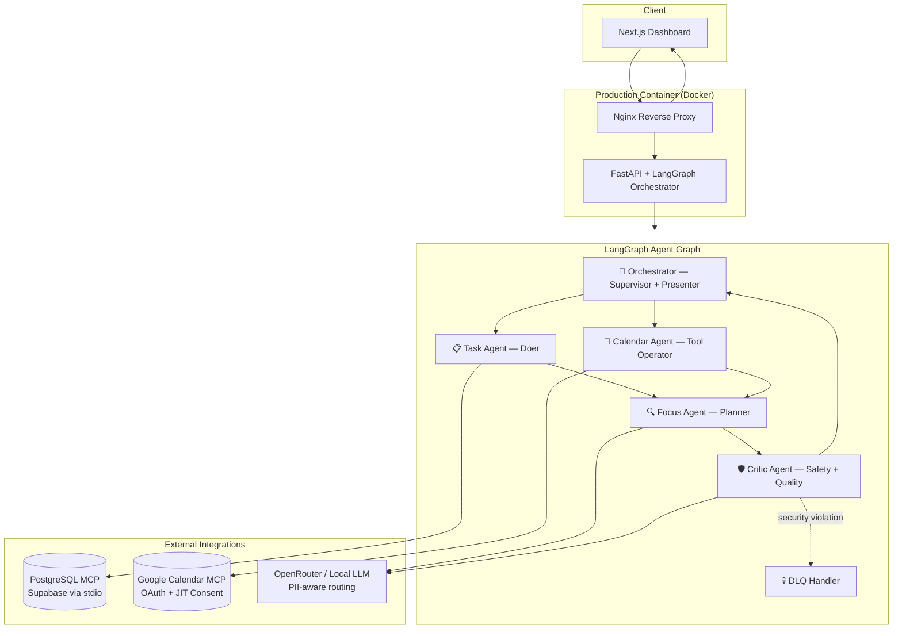

# 🧠 AI Daily Briefing Assistant
See [Project Proposal](007-01-ai-daily-briefing-assistant5.md) for full understanding.

---


---
> **Stop losing your mornings to scattered tools.** One intelligent agent pipeline — your tasks, calendar, and priorities unified into a single, secure, actionable daily briefing.

[](https://github.com/qasirdev/daily-briefing/actions)
[](https://www.python.org/)
[](https://www.typescriptlang.org/)
[](https://fastapi.tiangolo.com/)
[](https://nextjs.org/)
[](https://langchain-ai.github.io/langgraph/)
[](https://www.docker.com/)
[](docs/SECURITY.md)
[]()
[]()

---

## 🎯 Why This Project Exists

**Knowledge workers lose 30–60 minutes every morning** just reconciling information spread across task managers, calendars, and email. Before writing a single line of meaningful work, they're already mentally exhausted from context-switching.

The AI Daily Briefing Assistant was built to **eliminate that cognitive overhead entirely**.

Every morning, a supervisor-led AI pipeline automatically:

- Pulls your highest-priority tasks from your database
- Fetches today's calendar events via secure, consent-aware OAuth
- Uses an LLM to generate a focused, personalised work plan
- Has a dedicated Critic Agent review the output for quality *and* security threats
- Delivers one clean, sanitised briefing — ready to act on

No tab-switching. No mental assembly. Just clarity, from the moment your day begins.

---

## 💼 Daily Benefits for Knowledge Workers

| Benefit | What It Means for You |
|---|---|
| ⏱️ **Save 30–60 min/day** | Automated context assembly replaces your manual morning routine |
| 🧩 **Unified context** | Tasks + calendar + focus plan in one view, not three apps |
| 🛡️ **Privacy by design** | PII stays local; confidential data routes to a local LLM, never a cloud model |
| 🔐 **You stay in control** | Time-bounded consent; revoke calendar access anytime |
| 🎯 **Focus-first output** | The Focus Agent doesn't just list your day — it *plans* it intelligently |
| 📈 **Compounding value** | The system learns your preferences over time via the feedback loop |
| 🚨 **Security-aware** | Malicious calendar invites that attempt prompt injection are quarantined before any briefing is presented |

---

## ⚡ At a Glance

| Dimension | Summary |
|---|---|
| **Problem** | Knowledge workers lose hours reconciling tasks, meetings, and priorities each morning |
| **Solution** | Supervisor-led **LangGraph** pipeline: Task, Calendar, Focus, and Critic agents produce one sanitised daily briefing |
| **Differentiators** | OWASP GenAI hardening · JIT agentic consent · local LLM fallback for PII · MCP integrations · Cosign-signed images |
| **Quality bar** | 97 automated tests · strict MyPy · Ruff lint · GitHub Actions CI · E2E flows · Prometheus SLOs |
| **Deployment** | Option 1 Enterprise Hybrid — Supabase + stdio MCP + single Docker container (nginx **8088** → 80) |

---

## 🏗️ Architecture



**Core design principle: Orchestrator-as-Presenter.** Only sanitised markdown ever reaches the user. Agents return strict `AgentResultEnvelope` JSON; the Orchestrator alone maps these into the UI format — guaranteeing consistent tone, format, and security.

---

## 🤖 Agent Pipeline — How It Works

Each morning, five specialised agents collaborate through a deterministic graph:

### 1. 📋 Task Agent — *Doer*
Connects to your PostgreSQL database via the Model Context Protocol (MCP). Retrieves and priority-sorts your open tasks using Row-Level Security to ensure it only ever sees *your* data. Read-only by design.

### 2. 📅 Calendar Agent — *Tool Operator*
Fetches today's events from Google Calendar via OAuth, but **only after you've given explicit, time-bounded consent**. SSRF validation prevents the agent from reaching any unauthorised domain.

### 3. 🔍 Focus Agent — *Planner*
Receives task and calendar context and generates an intelligent, prioritised work plan using an LLM. Has **zero tool access** — it only reads, reasons, and writes. If your data is classified as `confidential_pii`, routing automatically switches to a local LLM.

### 4. 🛡️ Critic Agent — *Safety + Quality Gatekeeper*
Runs after the Focus Agent. Scans serialized task, calendar, and focus outputs with `PromptInjectionDetector`, then reviews focus quality. If a threat is found, it escalates immediately to the Dead Letter Queue — no retry, no user-facing output.

### 5. 🎯 Orchestrator — *Supervisor + Presenter*
Assembles all agent outputs into a single, sanitised, user-facing briefing. Applies `sanitize_markdown()` (nh3) on the backend and DOMPurify on the frontend. The only agent that shapes what users see.

---

## 🛠️ Technology Stack — Tools Used & Why

### AI & Orchestration

| Technology | Why We Chose It | Benefit |
|---|---|---|
| **LangGraph** | Deterministic state machine for multi-agent pipelines | Predictable, debuggable agent execution with built-in cycle detection and checkpointing |
| **OpenRouter** | Unified LLM routing across providers | Swap models without code changes; automatic fallback; cost control |
| **Model Context Protocol (MCP)** | Standardised tool interface for agents | Secure, schema-validated tool access with explicit capability boundaries |
| **Local LLM fallback** | Privacy-preserving inference | Confidential/PII data never leaves your infrastructure |

### Backend

| Technology | Why We Chose It | Benefit |
|---|---|---|
| **FastAPI** | Modern async Python API framework | Automatic OpenAPI docs, native async support, 3× faster than Flask for I/O-bound workloads |
| **Python 3.12** | Latest stable Python runtime | Improved performance, better error messages, `asyncio` improvements |
| **Pydantic v2** | Data validation and settings management | 5–50× faster than v1; strict type enforcement prevents malformed agent payloads |
| **LangChain ecosystem** | LLM tooling and integrations | Battle-tested prompt management, retry logic, and observability hooks |
| **uv** | Ultra-fast Python package manager | Deterministic installs, lockfile enforcement, 10–100× faster than pip |
| **Alembic + SQLAlchemy async** | Database migrations and ORM | Type-safe async queries; reproducible schema evolution |

### Frontend

| Technology | Why We Chose It | Benefit |
|---|---|---|
| **Next.js 16 (App Router)** | React meta-framework with server components | Streaming UI, built-in routing, SEO-ready, server-side rendering reduces time-to-first-byte |
| **React 19** | Latest React with concurrent features | Server Components reduce JS bundle size; useOptimistic for snappy UX |
| **TypeScript 5.x** | Typed JavaScript | Catches integration errors at compile time; agent envelope types shared end-to-end |
| **Tailwind CSS v4** | Utility-first CSS framework | Consistent design system, zero unused CSS in production |
| **DOMPurify** | Client-side HTML sanitisation | Last line of defence — strips any unsafe markup before rendering briefing content |
| **Zod** | TypeScript schema validation | Frontend validates API responses independently; no implicit trust of backend payloads |

### Data & Storage

| Technology | Why We Chose It | Benefit |
|---|---|---|
| **Supabase (PostgreSQL)** | Managed Postgres with Row-Level Security | Per-user data isolation enforced at the database layer, not just application logic |
| **Supavisor (port 6543)** | Connection pooler for Supabase | Handles thousands of concurrent connections without PostgreSQL saturation |
| **PostgreSQL MCP (stdio)** | Agent-safe database access | Parameterised queries only; agents cannot execute arbitrary SQL |
| **Google Calendar MCP (stdio)** | Calendar integration | Scoped `calendar.readonly` access; OAuth refresh handled securely via env |

### Security

| Technology | Why We Chose It | Benefit |
|---|---|---|
| **nh3** | Rust-backed HTML sanitiser | Allowlist-based; strips scripts, iframes, and unsafe attributes before storage |
| **PromptInjectionDetector** | Custom regex + Unicode normalisation | Catches obfuscated injection attempts that bypass simple keyword filters |
| **PIIDetector + mask_pii()** | Custom PII scanner and masker | Prevents email, phone, SSN, and card numbers from leaking into LLM payloads |
| **SSRFValidator** | URL allowlist + private IP blocker | MCP integrations cannot be redirected to internal network endpoints |
| **SlowAPI** | FastAPI rate limiting | Enforces per-endpoint request quotas; returns proper 429 responses |
| **pyjwt[crypto]** | JWT with RS256 signing | Production-grade asymmetric token verification |

### Observability & Infrastructure

| Technology | Why We Chose It | Benefit |
|---|---|---|
| **OpenTelemetry** | Vendor-neutral distributed tracing | `trace_id` propagated from HTTP request through every agent and log line |
| **Prometheus** | Metrics collection | SLO tracking, security violation counters, per-agent token usage dashboards |
| **structlog** | Structured JSON logging | Machine-parseable logs with consistent fields; security channel for audit events |
| **Docker (multi-stage)** | Containerised deployment | Reproducible builds; dev/prod parity; minimal attack surface via multi-stage |
| **Nginx** | Reverse proxy | TLS termination, static asset serving, upstream health-check routing |
| **Supervisord** | Process manager inside container | Manages uvicorn + Nginx as co-located processes in a single container |
| **Cosign + Sigstore** | Container image signing | Keyless supply chain verification via GitHub OIDC — proves image provenance |
| **GitHub Actions** | CI/CD pipeline | Automated lint, typecheck, test, build, and signed image publish on every push |

### Development Experience

| Technology | Why We Chose It | Benefit |
|---|---|---|
| **Ruff** | Extremely fast Python linter | Replaces Flake8 + isort + pyupgrade; 100× faster; enforces consistent code style |
| **MyPy (strict)** | Static type checking for Python | Catches type errors at development time, not in production |
| **pytest** | Python test framework | 97 tests including unit, security, integration, and E2E scenarios |
| **Cursor Development Agents** | AI-assisted implementation | Specialised coding, testing, refactor, and documentation agents with scoped rules |

---

## 🔐 Security Posture — Enterprise-Grade from Day One

This project implements the **OWASP GenAI Top 10** — the industry standard for LLM application security — across all seven applicable vulnerability categories.

| OWASP GenAI | Control | Status |
|---|---|---|
| **LLM01** Prompt Injection | Critic Agent + `PromptInjectionDetector`, DLQ escalation | ✅ Implemented |
| **LLM02** Insecure Output | `sanitize_markdown()` (nh3), Orchestrator-as-Presenter, DOMPurify | ✅ Implemented |
| **LLM04** Model DoS | Per-agent token budgets, circuit breaker, SlowAPI rate limits | ✅ Implemented |
| **LLM05** Supply Chain | `uv.lock` pinning, CI dependency audit, Cosign-signed images | ✅ Implemented |
| **LLM06** Sensitive Disclosure | PII masking, classification routing, masked LLM payloads | ✅ Implemented |
| **LLM07** Insecure Plugins | MCP SSRF allowlists, private IP blocking, read-only SQL | ✅ Implemented |
| **LLM08** Excessive Agency | Scoped agent boundaries, consent-gated MCP access | ✅ Implemented |

> Full details in [docs/SECURITY.md](docs/SECURITY.md)

---

## 🚀 Quick Start

### Prerequisites

- [uv](https://docs.astral.sh/uv/) >= 0.5
- Node.js 22.x (`nvm use`)
- Docker 27+ *(optional — for full stack)*

### Backend — local dev on port 8010

```bash
cp .env.example .env
uv sync --all-extras
uv run alembic upgrade head        # run once against Supabase
uv run uvicorn backend.main:app --reload \
  --reload-dir backend --reload-dir prompts \
  --host 127.0.0.1 --port 8010
```

```bash
curl http://127.0.0.1:8010/health        # liveness
curl http://127.0.0.1:8010/health/ready  # readiness
```

### Docker — full stack on port 8088

```bash
docker compose up --build -d
curl http://localhost:8088/health
```

See [docs/guidence/docker-setup.md](docs/guidence/docker-setup.md) and [docs/guidence/try-it-locally.md](docs/guidence/try-it-locally.md).

### Frontend — local dev on port 3010

```bash
cd frontend && npm ci && npm run dev
```

Open [http://localhost:3010](http://localhost:3010) — API auto-detects backend at port **8010** (or **8088** in Docker mode).

### Verify quality locally

```bash
uv run ruff check backend     # lint
uv run mypy backend           # type check
uv run pytest                 # 97 tests
```

---

## 🏭 Production Deployment

```bash
# 1. Configure secrets
cp .env.production.example .env
# Set JWT_SECRET_KEY, ADMIN_API_KEY, LLM keys

# 2. Verify signed image from GHCR
cosign verify \
  --certificate-identity-regexp='.*' \
  --certificate-oidc-issuer='https://token.actions.githubusercontent.com' \
  ghcr.io/qasirdev/daily-briefing@sha256:<digest>

# 3. Deploy
docker compose up -d
```

See [infrastructure/DEPLOYMENT.md](infrastructure/DEPLOYMENT.md) for full rollout and rollback runbook.

---

## 📐 Project Structure

```
backend/           FastAPI app · LangGraph agents · MCP clients · security modules
frontend/          Next.js dashboard (briefing · consent · observability UI)
prompts/           Versioned agent prompt contracts (XML + guardrails)
infrastructure/    Deployment guide · alerting rules · SLO dashboards · Cosign docs
docs/              Architecture · security · observability · execution standards
.github/workflows/ CI pipeline + Docker publish/sign workflow
.cursor/rules/     Scoped agent rules for Coding · Testing · Refactor · Docs agents
```

---

## 📊 Engineering Standards

| Practice | Implementation |
|---|---|
| **Testing** | 97 pytest cases — unit, security, live stdio integration, E2E |
| **Static analysis** | Ruff lint + MyPy strict mode on all backend code |
| **CI/CD** | GitHub Actions: lint → typecheck → test → Docker build → sign → publish |
| **Image supply chain** | GHCR publish + Cosign keyless signing + `cosign verify` gate before deploy |
| **Config management** | Pydantic Settings + `.env.example` + `.env.production.example` |
| **Documentation** | Architecture · Security · Observability · Deployment runbooks |
| **SLO targets** | 99.5% availability · P95 latency < 10s (see [docs/OBSERVABILITY.md](docs/OBSERVABILITY.md)) |

---

## 📚 Documentation Map

| Document | Purpose |
|---|---|
| [docs/ARCHITECTURE.md](docs/ARCHITECTURE.md) | System design, agent roles, data flows |
| [docs/SECURITY.md](docs/SECURITY.md) | OWASP GenAI matrix, threat model, controls |
| [docs/OBSERVABILITY.md](docs/OBSERVABILITY.md) | Tracing, Prometheus metrics, SLOs |
| [docs/AGENTIC-CONSENT.md](docs/AGENTIC-CONSENT.md) | Consent flows, token lifecycle, revocation |
| [docs/LOCAL-LLM.md](docs/LOCAL-LLM.md) | Local model benchmarks, hardware requirements |
| [docs/DATA-OWNERSHIP.md](docs/DATA-OWNERSHIP.md) | GDPR compliance, retention, PII handling |
| [infrastructure/DEPLOYMENT.md](infrastructure/DEPLOYMENT.md) | Production rollout and rollback |
| [docs/PLAN.md](docs/PLAN.md) | Implementation roadmap — 52/52 tasks complete |
| [AGENT.md](AGENT.md) | Engineering workflow and conventions |

---

## 🔍 ATS Technology Keywords

```
Python 3.12, FastAPI, Pydantic v2, LangGraph, LangChain ecosystem, OpenAI SDK, OpenRouter,
httpx, structlog, uvicorn, PostgreSQL, Model Context Protocol (MCP), Prometheus,
OpenTelemetry, OTLP, slowapi, nh3, tenacity, pytest, MyPy, Ruff, uv,
TypeScript, React 19, Next.js 16 App Router, Tailwind CSS v4, DOMPurify, Zod,
Docker, multi-stage builds, Nginx, Supervisord, GitHub Actions, Cosign, Sigstore,
OWASP GenAI Top 10, prompt injection defense, PII masking, SSRF validation,
rate limiting, circuit breakers, dead letter queue (DLQ), GDPR export, OAuth 2.0 consent,
multi-agent orchestration, agentic AI, LLM security, AI safety, enterprise AI,
Row-Level Security, Supabase, Alembic, SQLAlchemy async, Supavisor, Google Calendar API,
JWT RS256, Argon2id, TLS 1.3, structured logging, distributed tracing, trace propagation
```

---

## 📦 Implementation Status

All six MVPs delivered across **52 tracked tasks**: scaffold · core agents · observability · agentic consent · security hardening · production deployment.

---

## 📄 License

Private — internal use only.

---

*Production-grade multi-agent AI platform — Version 1.6.0 — May 2026*
