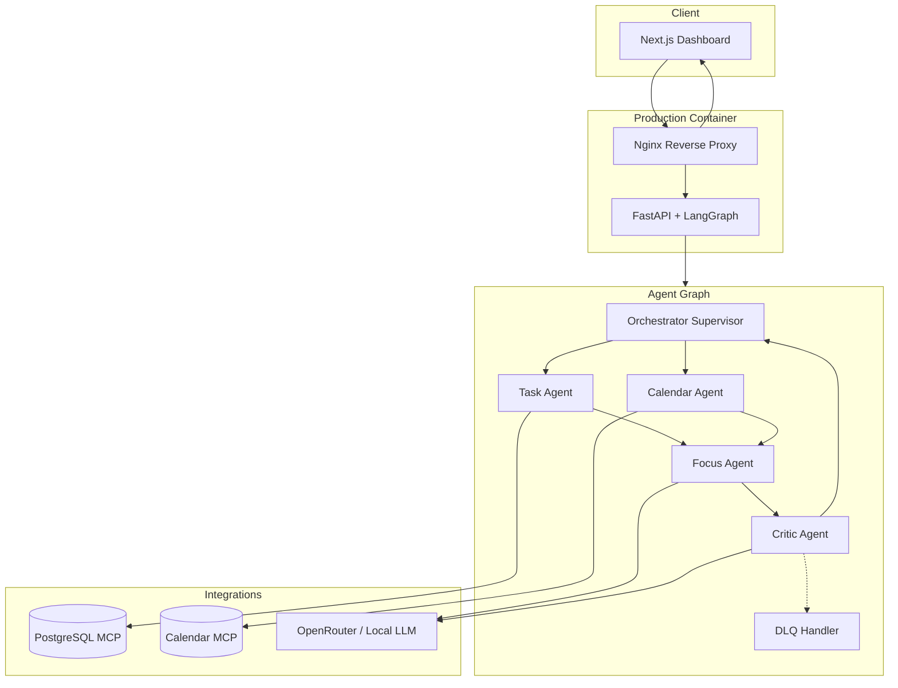

# AI Daily Briefing Assistant

**Production-grade multi-agent AI platform** that synthesizes personalized daily briefings from tasks, calendar, and user context — with enterprise security, observability, and agentic consent built in.

[](https://github.com/qasirdev/daily-briefing/actions)
[](https://www.python.org/)
[](https://www.typescriptlang.org/)
[](https://fastapi.tiangolo.com/)
[](https://nextjs.org/)
[](https://langchain-ai.github.io/langgraph/)
[](https://www.docker.com/)
[](docs/SECURITY.md)

---

## At a Glance

| Dimension | Summary |
|-----------|---------|
| **Problem** | Knowledge workers lose hours reconciling tasks, meetings, and priorities each morning |
| **Solution** | Supervisor-led **LangGraph** pipeline: Task, Calendar, Focus, and Critic agents produce one sanitized daily briefing |
| **Differentiators** | OWASP GenAI hardening, JIT agentic consent, local LLM fallback for PII, MCP integrations, Cosign-signed images |
| **Quality bar** | 86 automated tests, strict MyPy, Ruff lint, GitHub Actions CI, E2E flows, Prometheus SLOs |
| **Deployment** | Single production container (Nginx + FastAPI + Next.js), GHCR, health/readiness probes, graceful shutdown |

---

## Technology Stack

Plain-text keyword block for ATS and recruiter search:

```
Python 3.12, FastAPI, Pydantic v2, LangGraph, LangChain ecosystem, OpenAI SDK, OpenRouter,
httpx, structlog, uvicorn, PostgreSQL, Model Context Protocol (MCP), Prometheus,
OpenTelemetry, OTLP, slowapi, nh3, tenacity, pytest, MyPy, Ruff, uv,
TypeScript, React 19, Next.js 16 App Router, Tailwind CSS v4, DOMPurify, Zod,
Docker, multi-stage builds, Nginx, Supervisord, GitHub Actions, Cosign, Sigstore,
OWASP GenAI Top 10, prompt injection defense, PII masking, SSRF validation,
rate limiting, circuit breakers, dead letter queue (DLQ), GDPR export, OAuth consent
```

### By layer

| Layer | Technologies |
|-------|----------------|
| **AI / Agents** | LangGraph, multi-agent orchestration, LLM router (OpenRouter + local fallback), externalized prompts |
| **Backend API** | FastAPI, Pydantic Settings, async Python, REST `/api/v1/*` |
| **Frontend** | Next.js 16, React 19, TypeScript, Tailwind CSS 4, client-side sanitization |
| **Data & Tools** | PostgreSQL MCP (read-only, RLS), Google Calendar MCP, JIT consent store |
| **Security** | OWASP GenAI LLM01–LLM08, nh3 output sanitization, PII detector, SSRF allowlists, rate limits |
| **Observability** | OpenTelemetry traces, Prometheus metrics, structured JSON logs, SLO recording rules |
| **DevOps** | Docker, GitHub Actions, GHCR, Cosign keyless signing, health/readiness probes |

---

## Architecture



**Design principles:** Orchestrator-as-Presenter (only sanitized markdown reaches users), strict `AgentResultEnvelope` contracts, trace_id propagation end-to-end, fail-secure escalation to DLQ.

---

## Core Capabilities

### Multi-agent briefing pipeline
- **Task Agent** — priority-sorted tasks via PostgreSQL MCP  
- **Calendar Agent** — same-day events with consent-aware access  
- **Focus Agent** — LLM-generated focus plan from aggregated context  
- **Critic Agent** — quality review + prompt injection scanning  
- **Orchestrator** — routes, synthesizes, and presents the final briefing  

### Agentic consent & privacy (MVP 4)
- Just-in-time consent prompts for Google Calendar MCP  
- Time-bounded consent records, audit log, settings dashboard  
- Local LLM fallback when data classification is `confidential_pii`  
- GDPR-style export endpoint (`/api/v1/export`)  

### Security & compliance (MVP 5)
Production controls aligned with [docs/SECURITY.md](docs/SECURITY.md):

| OWASP GenAI | Control |
|-------------|---------|
| **LLM01** Prompt injection | Critic agent + `PromptInjectionDetector`, DLQ escalation |
| **LLM02** Insecure output | nh3 sanitization, Orchestrator-as-Presenter, DOMPurify on FE |
| **LLM04** Model DoS | Per-agent token budgets, circuit breaker, SlowAPI rate limits |
| **LLM05** Supply chain | `uv.lock` pinning, CI dependency checks |
| **LLM06** Sensitive disclosure | PII masking in logs, masked LLM payloads, classification routing |
| **LLM07** Insecure plugins | MCP SSRF allowlists (`*.googleapis.com`), read-only SQL validation |
| **LLM08** Excessive agency | Scoped agent boundaries, consent-gated MCP access |

Dedicated security test suite: `backend/tests/security/` (injection, sanitization, PII, SSRF, rate limits).

### Observability & production ops (MVP 3 + 6)
- OpenTelemetry OTLP export, Prometheus `/metrics/`  
- Structured logging with `trace_id` on every request  
- SLO targets: 99.5% availability, P95 latency under 10s ([docs/OBSERVABILITY.md](docs/OBSERVABILITY.md))  
- Liveness `GET /health` and readiness `GET /health/ready`  
- Graceful SIGTERM shutdown with request draining  
- Cosign-signed container images via GitHub Actions  

---

## Quality & Engineering Standards

| Practice | Implementation |
|----------|----------------|
| **Testing** | 86 pytest cases including unit, security, and E2E (`backend/tests/e2e/`) |
| **Static analysis** | Ruff lint + MyPy strict mode on backend |
| **CI/CD** | GitHub Actions: lint, typecheck, test, Docker build, workflow docs |
| **Image supply chain** | GHCR publish + Cosign keyless verify |
| **Config** | Pydantic Settings, `.env.example`, `.env.production.example` |
| **Docs** | Architecture, security, observability, deployment runbooks |

---

## Quick Start

### Prerequisites

- [uv](https://docs.astral.sh/uv/) >= 0.5  
- Node.js 22.x (`nvm use`)  
- Docker 27+ (optional full stack)  

### Backend

```bash
cp .env.example .env
uv sync --all-extras
uv run uvicorn backend.main:app --reload --host 0.0.0.0 --port 8000
```

Health: `curl http://localhost:8000/health`  
Readiness: `curl http://localhost:8000/health/ready`  

### Frontend

```bash
cd frontend && npm ci && npm run dev
```

Open [http://localhost:3000](http://localhost:3000)

### Full stack (Docker)

```bash
cp .env.example .env
docker compose up --build
```

Open [http://localhost](http://localhost) — API at `/api/v1/`, metrics at `/metrics/`.

> If port 80 is busy, map `"8080:80"` in `docker-compose.yml` and use [http://localhost:8080](http://localhost:8080).

### Verify quality locally

```bash
uv run ruff check backend
uv run mypy backend
uv run pytest
```

---

## Production Deployment

1. Copy [`.env.production.example`](.env.production.example) and set secrets (`JWT_SECRET_KEY`, `ADMIN_API_KEY`, LLM keys).  
2. Pull and **verify** the Cosign-signed image from GHCR ([infrastructure/DEPLOYMENT.md](infrastructure/DEPLOYMENT.md)).  
3. Configure probes: liveness `/health`, readiness `/health/ready`.  
4. Load Prometheus recording rules and alerts from `infrastructure/monitoring/` and `infrastructure/alerting/`.  

```bash
cosign verify \
  --certificate-identity-regexp='.*' \
  --certificate-oidc-issuer='https://token.actions.githubusercontent.com' \
  ghcr.io/qasirdev/daily-briefing@sha256:<digest>
```

---

## Project Structure

```
backend/           FastAPI app, LangGraph agents, MCP clients, security modules
frontend/          Next.js dashboard (briefing, consent, observability UI)
prompts/           Versioned agent prompt contracts (XML + guardrails)
infrastructure/    Deployment guide, alerting rules, SLO dashboards, Cosign docs
docs/              Architecture, security, observability, execution standards
.github/workflows/ CI pipeline + Docker publish/sign workflow
```

---

## Documentation

| Document | Purpose |
|----------|---------|
| [docs/ARCHITECTURE.md](docs/ARCHITECTURE.md) | System design and agent roles |
| [docs/SECURITY.md](docs/SECURITY.md) | OWASP GenAI matrix and threat model |
| [docs/OBSERVABILITY.md](docs/OBSERVABILITY.md) | Tracing, metrics, SLOs |
| [infrastructure/DEPLOYMENT.md](infrastructure/DEPLOYMENT.md) | Production rollout and rollback |
| [docs/PLAN.md](docs/PLAN.md) | Implementation roadmap (52/52 tasks complete) |
| [AGENT.md](AGENT.md) | Engineering workflow and conventions |

---

## Implementation Status

All six MVPs delivered across 52 tracked tasks: scaffold, core agents, observability, agentic consent, security hardening, and production deployment.

---

## License

Private — internal use.
