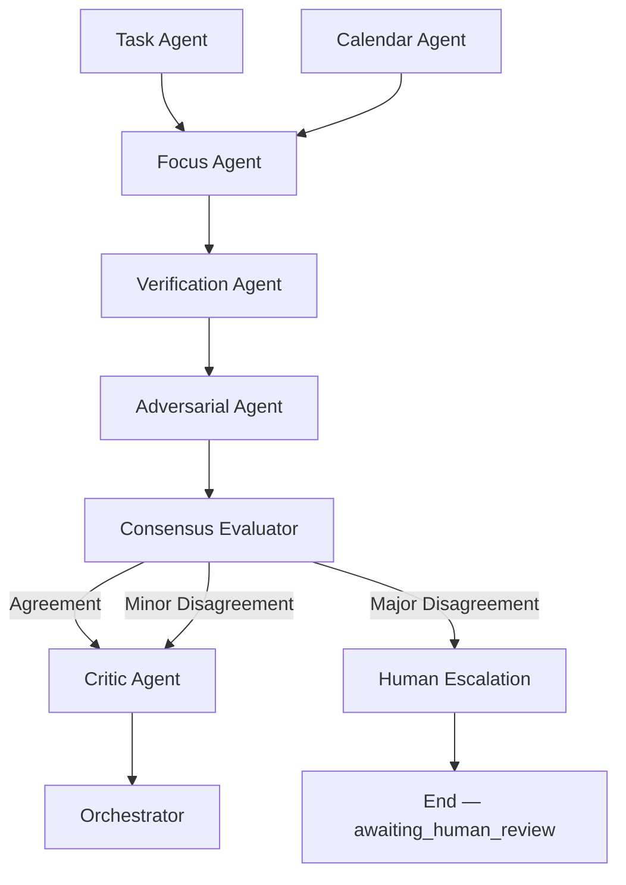

# System Architecture — AI Daily Briefing Assistant

**Version:** 1.7.0 (Option 1 Enterprise Hybrid) | **Last Updated:** June 2026

---

## Overview

The AI Daily Briefing Assistant is deployed via a **single Docker container** topology. **Option 1 (Enterprise Hybrid)** adds stdio MCP servers, **Supabase** persistence (port **6543**, Supavisor), and SQLAlchemy/Alembic for DLQ, consent, and preferences — while agents access tasks only through PostgreSQL MCP.

---

## Deployment Topology

```
┌─────────────────────────────────────────────────────────────────┐
│                     Single Docker Container                      │
│  Host: http://localhost:8088  →  nginx :80                       │
│  ┌───────────────────────────────────────────────────────────┐  │
│  │                      supervisord                           │  │
│  │  ┌────────┐ ┌──────────┐ ┌─────────┐ ┌─────────────────┐  │  │
│  │  │ nginx  │ │ mcp-pg   │ │ mcp-cal │ │ uvicorn :8000   │  │  │
│  │  │ :80    │ │ (stdio)  │ │ (stdio) │ │ next.js :3000   │  │  │
│  │  └───┬────┘ └────┬─────┘ └────┬────┘ └────────┬────────┘  │  │
│  │      │ /api/*→8000  │          │             │ /*→3000   │  │
│  └──────┼──────────────┼──────────┼─────────────┼────────────┘  │
│         │              │          │             │                │
│  ┌──────┴──────────────┴──────────┴─────────────┴────────────┐  │
│  │  LangGraph agents spawn stdio MCP clients (on demand)      │  │
│  │  SQLAlchemy (async) → Supabase :6543 (DLQ, consent, prefs) │  │
│  └────────────────────────────────────────────────────────────┘  │
└─────────────────────────────────────────────────────────────────┘
          │                              │
          ▼                              ▼
┌─────────────────────┐       ┌─────────────────────┐
│ Supabase PostgreSQL │       │ Google Calendar API │
│ (external, :6543)   │       │ (googleapis.com)    │
└─────────────────────┘       └─────────────────────┘
```

### Port map

| Context | nginx | FastAPI | Next.js | Browser URL |
|---|---|---|---|---|
| **Docker (production-like)** | 80 (host **8088**) | 8000 | 3000 | http://localhost:8088 |
| **Local dev** | — | **8010** | **3010** | http://localhost:3010 |

See [guidence/docker-setup.md](./guidence/docker-setup.md) and [guidence/try-it-locally.md](./guidence/try-it-locally.md).

---

## Option 1 data paths

| Path | Technology | Used by |
|---|---|---|
| Task reads | PostgreSQL MCP (stdio) → Supabase | Task Agent only |
| Calendar reads | Calendar MCP (stdio) → Google API | Calendar Agent only |
| DLQ, consent, preferences | SQLAlchemy async + Alembic | FastAPI services (not agents) |

Agents **never** call SQLAlchemy directly for task queries.

---

## Component Stack

| Layer | Technology | Version | Purpose |
|---|---|---|---|
| **Reverse Proxy** | Nginx | 1.27.x | Route `/api` to FastAPI, `/` to Next.js |
| **Process Manager** | Supervisord | 4.2.x | Manage child processes, handle restarts |
| **Frontend** | Next.js | 16.x | App Router, Server Components, React 19 (Hooks: use, useTransition, useOptimistic, useActionState) |
| **Backend** | FastAPI | 0.115.x | REST API, WebSocket support |
| **Python Runtime** | Python | 3.12+ | Managed by `uv` |
| **Orchestration** | LangGraph | 0.4.x | Stateful multi-agent graphs |
| **Validation** | Pydantic | 2.8.x | Request/Response schemas |
| **MCP Protocol** | MCP SDK | 1.x | Model Context Protocol clients |

---

## Multi-Agent Orchestration (LangGraph)

The system operates on a rigorous supervisor-worker pattern with defined roles:

```
                    ┌─────────────────────────────┐
                    │        User Request         │
                    └──────────────┬──────────────┘
                                   ▼
                    ┌─────────────────────────────┐
                    │     Orchestrator Agent      │
                    │  (Supervisor + Presenter)   │
                    └──────────────┬──────────────┘
                                   │
           ┌───────────────────────┼───────────────────────┐
           ▼                       ▼                       ▼
┌─────────────────────┐ ┌─────────────────────┐ ┌─────────────────────┐
│    Task Agent       │ │   Calendar Agent    │ │    Focus Agent      │
│      (Doer)         │ │  (Tool Operator)    │ │     (Planner)       │
│                     │ │                     │ │                     │
│ PostgreSQL MCP      │ │ Google Calendar MCP │ │    LLM Only         │
│ Read-only scope     │ │ SSRF defense        │ │ Instruction hierarchy│
└─────────┬───────────┘ └─────────┬───────────┘ └─────────┬───────────┘
          │                       │                       │
          └───────────────────────┼───────────────────────┘
                                  ▼
                    ┌─────────────────────────────┐
                    │       Critic Agent          │
                    │   (Safety + Quality)        │
                    │                             │
                    │ Max 2-cycle revision loop   │
                    │ Prompt injection scanning   │
                    └──────────────┬──────────────┘
                                   │
                    ┌──────────────┴──────────────┐
                    ▼                             ▼
         ┌─────────────────┐           ┌─────────────────┐
         │    Success      │           │    Failure      │
         │                 │           │                 │
         │ Orchestrator    │           │ Route to DLQ    │
         │ presents final  │           │ Degraded UI     │
         │ markdown        │           │                 │
         └─────────────────┘           └─────────────────┘
```

---

## Agent Role Definitions

### 1. Orchestrator (Supervisor + Presenter)

| Attribute | Value |
|---|---|
| **Canonical Role** | Supervisor + Presenter |
| **Responsibilities** | Route requests, manage state, synthesize final markdown |
| **Input** | User briefing request |
| **Output** | `AgentResultEnvelope` with user-facing briefing |
| **Tools/MCP** | None (coordinates other agents) |
| **Security** | Only component that produces user-facing content |

### 2. Task Agent (Doer)

| Attribute | Value |
|---|---|
| **Canonical Role** | Doer |
| **Responsibilities** | Read and prioritize tasks from database |
| **Input** | User context, date range |
| **Output** | `AgentResultEnvelope` with task list JSON |
| **Tools/MCP** | PostgreSQL MCP (read-only) |
| **Security** | RLS enforced, read-only database access |

### 3. Calendar Agent (Tool Operator)

| Attribute | Value |
|---|---|
| **Canonical Role** | Tool Operator |
| **Responsibilities** | Fetch today's calendar events |
| **Input** | User context, date |
| **Output** | `AgentResultEnvelope` with events JSON |
| **Tools/MCP** | Google Calendar MCP |
| **Security** | Strict allowlist, SSRF defense, JIT consent |

### 4. Focus Agent (Planner)

| Attribute | Value |
|---|---|
| **Canonical Role** | Planner |
| **Responsibilities** | Generate time-blocked work plan |
| **Input** | Aggregated tasks + events context |
| **Output** | `AgentResultEnvelope` with plan JSON |
| **Tools/MCP** | LLM only (no external tools) |
| **Memory** | Working memory (session) + Semantic retrieval (pgvector) |
| **Security** | Instruction hierarchy enforced |

### 5. Critic Agent (Critic)

| Attribute | Value |
|---|---|
| **Canonical Role** | Critic (Safety + Quality) |
| **Responsibilities** | Review outputs for coherence, safety violations |
| **Input** | Aggregated agent outputs |
| **Output** | `AgentResultEnvelope` with review/approval |
| **Tools/MCP** | LLM only |
| **Security** | Final output gatekeeper, prompt injection detector |

---

## Multi-Agent Verification Architecture

When `ENABLE_CONSENSUS_WORKFLOW=true`, the briefing pipeline adds a **Generator → Verification → Adversarial → Consensus** stage between Focus and Critic. Default (`false`) preserves the legacy Focus → Critic path for production stability during Week 1 rollout.

### Workflow Diagram



### Agent Roles (Consensus Path)

| Agent | Role | Purpose |
|---|---|---|
| Task Agent | Doer | Fetches tasks from PostgreSQL MCP |
| Calendar Agent | Tool Operator | Fetches events from Google Calendar MCP |
| Focus Agent | Planner | Generates briefing plan from aggregated data |
| Verification Agent | Verifier | Fact-checks Focus output against raw MCP data |
| Adversarial Agent | Red Team | Challenges assumptions and identifies edge cases |
| Consensus Evaluator | Aggregator | Counts concerns and selects routing path |
| Critic Agent | Safety + Quality | Final security scan and quality check |
| Orchestrator | Supervisor + Presenter | Synthesizes final sanitized markdown |

### Consensus Decision Matrix

| Major Concerns | Moderate Concerns | Route |
|---|---|---|
| 0 | 0 | Agreement → Proceed to Critic |
| 0 | 1+ | Minor Disagreement → Proceed to Critic with warning |
| 2+ | Any | Major Disagreement → Human Escalation (`awaiting_human_review`) |

Major concerns are counted from Verification `critical` discrepancies (when escalated) and Adversarial `severe` challenges. See `backend/agents/consensus/node.py` and `docs/learning/week1-consensus-pattern.md`.

---

## Prompt Caching (Week 2)

Static agent prompts are assembled in cache-eligible block order and warmed on startup. Dynamic user payloads (MCP data, semantic memory hits) are always appended last and never cached.

| Component | Path |
|---|---|
| Prompt assembly | `backend/prompts_loader.py` |
| Message builder | `backend/llm/prompt_cache.py` |
| Cache warmer | `PromptCacheWarmer` (240s refresh) |
| Metrics | `llm_cache_hit_rate`, `llm_cache_hit_total`, `llm_cache_miss_total` |
| ROI helpers | `backend/llm/cache_roi.py` |

See `docs/learning/week2-caching-and-memory.md` for cache-eligible agents and Week 1 baseline comparison.

---

## CoALA Memory Layers (Week 2 — Option A)

```
┌─────────────────────────────────────────────────────────────┐
│  Layer 1: Working Memory (ephemeral, LangGraph state)       │
│  working_memory_tokens | working_memory_limit | context[]   │
│  Manager: backend/memory/working.py                         │
│  Metric: working_memory_utilization                         │
└──────────────────────────┬──────────────────────────────────┘
                           │ retrieval query
                           ▼
┌─────────────────────────────────────────────────────────────┐
│  Layer 2: Semantic Memory (pgvector on Supabase)            │
│  Table: semantic_memory (HNSW + RLS)                        │
│  Store: backend/memory/semantic.py                          │
│  Retrieval: backend/memory/retrieval.py                       │
│  Audit: backend/memory/audit.py → memory_reads_total        │
└─────────────────────────────────────────────────────────────┘
```

Focus agent reads working context, queries semantic memory for similar past briefings, injects hits into the LLM payload, and stores successful plan summaries for future retrieval.

**Migration:** `uv run alembic upgrade head` from project root (`alembic.ini`, not `backend/alembic.ini`).

Procedural and Episodic layers → Week 3.

---

## Data Flow Sequence

```
┌────────┐     ┌─────────────┐     ┌────────────┐     ┌──────────────┐
│ Client │────▶│   Nginx     │────▶│  FastAPI   │────▶│  LangGraph   │
└────────┘     └─────────────┘     └────────────┘     └──────┬───────┘
                                                              │
                                   ┌──────────────────────────┤
                                   ▼                          ▼
                            ┌────────────┐            ┌────────────┐
                            │ Task Agent │            │ Cal Agent  │
                            └─────┬──────┘            └─────┬──────┘
                                  │                         │
                                  ▼                         ▼
                            ┌────────────┐            ┌────────────┐
                            │ Postgres   │            │ Google API │
                            │ MCP        │            │ MCP        │
                            └────────────┘            └────────────┘
```

---

## State Management

### LangGraph State Schema

```python
class BriefingGraphState(TypedDict):
    """Shared state across the agent graph."""
    
    # Request context
    user_id: str
    request_id: str
    trace_id: str
    requested_at: datetime
    
    # Agent outputs (accumulated)
    task_result: AgentResultEnvelope | None
    calendar_result: AgentResultEnvelope | None
    focus_result: AgentResultEnvelope | None
    verification_result: AgentResultEnvelope | None
    adversarial_result: AgentResultEnvelope | None
    consensus_result: dict[str, object] | None
    critic_result: AgentResultEnvelope | None
    
    # Execution tracking
    current_agent: str
    revision_count: int
    total_tokens: int
    working_memory_tokens: int
    working_memory_limit: int
    working_memory_context: list[str]
    
    # Final output
    final_briefing: str | None
    status: Literal["pending", "success", "failure", "degraded", "awaiting_consent", "awaiting_human_review"]
```

---

## Error Handling & Resilience

### Circuit Breaker Pattern

| Condition | Action |
|---|---|
| Token budget exceeded (2x limit) | Immediate termination, route to DLQ |
| MCP timeout (>30s) | Retry once, then route to DLQ |
| Critic rejects after 2 cycles | Accept degraded output or route to DLQ |
| Prompt injection detected | Immediate termination, no retry, security log |

### Dead Letter Queue (DLQ)

Failed requests are persisted for analysis and optional retry:

```sql
CREATE TABLE dlq_events (
    id UUID PRIMARY KEY DEFAULT gen_random_uuid(),
    request_id UUID NOT NULL,
    user_id UUID NOT NULL,
    agent_id VARCHAR(50) NOT NULL,
    reason VARCHAR(100) NOT NULL,
    envelope JSONB NOT NULL,
    created_at TIMESTAMPTZ DEFAULT NOW(),
    retried_at TIMESTAMPTZ,
    retry_count INTEGER DEFAULT 0
);
```

---

## Security Architecture

See `docs/SECURITY.md` for comprehensive security documentation.

### Key Security Boundaries

```
┌─────────────────────────────────────────────────────────────┐
│                    Trust Boundary                            │
│  ┌───────────────────────────────────────────────────────┐  │
│  │              Internal Agent Communication              │  │
│  │                                                        │  │
│  │  Task Agent ◄──► Orchestrator ◄──► Focus Agent       │  │
│  │       ▲              ▲                                 │  │
│  │       │              │                                 │  │
│  │       ▼              ▼                                 │  │
│  │  Critic Agent ◄──► Calendar Agent                     │  │
│  │                                                        │  │
│  └───────────────────────────────────────────────────────┘  │
│                          │                                   │
│  ════════════════════════╪═══════════════════════════════   │
│         UNTRUSTED        │        UNTRUSTED                  │
│                          ▼                                   │
│  ┌──────────────────┐   ┌──────────────────────────────┐   │
│  │ External LLM API │   │ Google Calendar (user data)  │   │
│  │ (OpenRouter)     │   │ Potential injection vector   │   │
│  └──────────────────┘   └──────────────────────────────┘   │
└─────────────────────────────────────────────────────────────┘
```

---

## Deployment Checklist

- [ ] Docker image built with multi-stage Dockerfile
- [ ] Docker image signed in CI/CD pipeline
- [ ] Environment variables validated at startup
- [ ] PostgreSQL connection pool configured
- [ ] MCP servers configured with security constraints
- [ ] OpenTelemetry collector endpoint configured
- [ ] Health check endpoints responding
- [ ] Rate limiting middleware active

---

*Architecture Documentation — Version 1.7.0 — June 2026*
