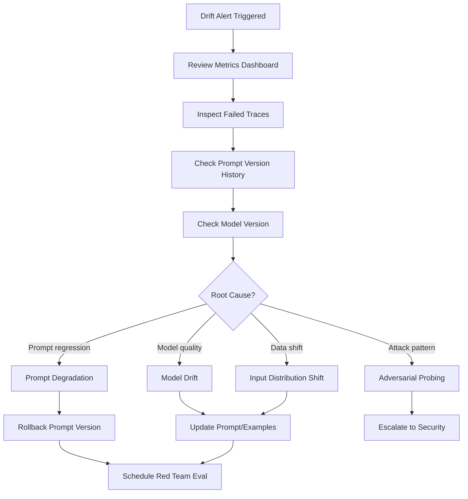

# Observability & Tracing — AI Daily Briefing Assistant

**Version:** 1.5.0 | **Last Updated:** May 2026

---

## Overview

The AI Daily Briefing Assistant implements comprehensive observability using OpenTelemetry for distributed tracing, Prometheus for metrics, and structured logging for audit trails.

**Local setup (beginner):** Before Week 1 kickoff, follow [docs/guidence/observability/README.md](guidence/observability/README.md) to install Prometheus, Grafana, and PagerDuty alert routing via Docker Compose.

```
┌─────────────────────────────────────────────────────────────┐
│                     Application                              │
│  ┌─────────────────────────────────────────────────────┐    │
│  │              OpenTelemetry SDK                       │    │
│  │  Traces ──────┬───────────────────────────────────   │    │
│  │  Metrics ─────┼───────────────────────────────────   │    │
│  │  Logs ────────┼───────────────────────────────────   │    │
│  └───────────────┼───────────────────────────────────┘    │
│                  │                                          │
└──────────────────┼──────────────────────────────────────────┘
                   │ OTLP (gRPC/HTTP)
                   ▼
┌─────────────────────────────────────────────────────────────┐
│              OpenTelemetry Collector                         │
│  ┌─────────┐  ┌─────────────┐  ┌───────────────────────┐   │
│  │ Jaeger  │  │ Prometheus  │  │ Loki (optional)       │   │
│  │ (traces)│  │ (metrics)   │  │ (logs)                │   │
│  └─────────┘  └─────────────┘  └───────────────────────┘   │
└─────────────────────────────────────────────────────────────┘
```

---

## Distributed Tracing

### Trace Context Propagation

Every request receives a `trace_id` that propagates through all agents and MCP calls:

```python
from opentelemetry import trace
from opentelemetry.propagate import inject, extract

tracer = trace.get_tracer("daily-briefing")

@app.post("/api/v1/briefing/generate")
async def generate_briefing(request: Request):
    with tracer.start_as_current_span("generate_briefing") as span:
        trace_id = format(span.get_span_context().trace_id, '032x')
        
        state = BriefingGraphState(
            user_id=user.id,
            request_id=str(uuid.uuid4()),
            trace_id=trace_id,
            ...
        )
        
        result = await graph.ainvoke(state)
        return result
```

### Span Hierarchy

```
generate_briefing (root span)
├── orchestrator.route
│   ├── task_agent.execute
│   │   └── mcp.postgres.query
│   ├── calendar_agent.execute
│   │   └── mcp.calendar.get_events
│   └── focus_agent.execute
│       └── llm.chat_completion
├── critic_agent.execute
│   └── llm.chat_completion
└── orchestrator.present
```

### Required Span Attributes

| Attribute | Type | Description |
|---|---|---|
| `user.id` | string | User identifier (hashed for privacy) |
| `request.id` | string | Unique request identifier |
| `agent.id` | string | Agent that created the span |
| `agent.role` | string | Canonical role (doer, planner, etc.) |
| `llm.model` | string | Model used for completion |
| `llm.tokens.input` | int | Input tokens consumed |
| `llm.tokens.output` | int | Output tokens generated |
| `mcp.server` | string | MCP server name |
| `mcp.tool` | string | MCP tool called |
| `data.classification` | string | Data classification level |

### Trace ID in AgentResultEnvelope

```json
{
  "agent_id": "focus",
  "metadata": {
    "trace_id": "4bf92f3577b34da6a3ce929d0e0e4736",
    "execution_ms": 1234,
    "tokens_used": 512
  }
}
```

---

## Metrics Registry

### Application Metrics

| Metric Name | Type | Labels | Description |
|---|---|---|---|
| `briefing_generation_duration_seconds` | Histogram | `status`, `degraded` | End-to-end briefing generation time |
| `briefing_requests_total` | Counter | `status` | Total briefing requests |
| `agent_execution_duration_seconds` | Histogram | `agent_id`, `role`, `status` | Per-agent execution time |
| `agent_executions_total` | Counter | `agent_id`, `role`, `status` | Total agent executions |

### LLM Metrics

| Metric Name | Type | Labels | Description |
|---|---|---|---|
| `llm_tokens_used_total` | Counter | `agent_id`, `model`, `direction` | Tokens consumed (input/output) |
| `llm_request_duration_seconds` | Histogram | `model`, `status` | LLM API latency |
| `llm_requests_total` | Counter | `model`, `status` | Total LLM requests |
| `llm_fallback_total` | Counter | `from_model`, `to_model`, `reason` | Fallback triggers |

### MCP Metrics

| Metric Name | Type | Labels | Description |
|---|---|---|---|
| `mcp_call_duration_seconds` | Histogram | `server`, `tool`, `status` | MCP tool call latency |
| `mcp_calls_total` | Counter | `server`, `tool`, `status` | Total MCP calls |
| `mcp_errors_total` | Counter | `server`, `tool`, `error_type` | MCP errors |
| `mcp_active_connections` | Gauge | `server` | Active MCP connections |

### DLQ Metrics

| Metric Name | Type | Labels | Description |
|---|---|---|---|
| `dlq_events_total` | Counter | `reason`, `agent_id` | Dead letter queue entries |
| `dlq_retry_total` | Counter | `reason`, `success` | DLQ retry attempts |
| `dlq_queue_size` | Gauge | — | Current DLQ size |

### Security Metrics

| Metric Name | Type | Labels | Description |
|---|---|---|---|
| `security_violations_total` | Counter | `type`, `agent_id` | Security events |
| `token_budget_exceeded_total` | Counter | `agent_id` | Budget overruns |
| `consent_requests_total` | Counter | `mcp_server`, `outcome` | Consent prompts |

### Memory & AgentOps Metrics (Week 4)

| Metric Name | Type | Labels | Description |
|---|---|---|---|
| `embedding_requests_total` | Counter | `provider`, `status` | Embedding API calls (OpenRouter or deterministic) |
| `embedding_duration_ms` | Histogram | `provider` | Embedding latency in milliseconds |
| `memory_quarantine_total` | Counter | `memory_layer`, `action` | Quarantine, restore, and delete actions |
| `consensus_disagreement_total` | Counter | `agreement_level` | Multi-agent consensus disagreements |
| `memory_consolidation_duration_seconds` | Histogram | — | Semantic consolidation job duration |
| `audit_log_entries_total` | Counter | `event_type` | Sealed security audit log entries appended |
| `audit_chain_verification_failures_total` | Counter | — | Hash-chain tamper detection failures |
| `credential_issuance_total` | Counter | `service`, `intent` | JIT credential broker issuance events |

---

## Prometheus Configuration

**Local setup:** Use Docker Compose in [docs/guidence/observability/](guidence/observability/README.md) — scrapes the app at `host.docker.internal:8010` when running uvicorn locally.

```yaml
# docs/guidence/observability/config/prometheus.yml
global:
  scrape_interval: 15s

scrape_configs:
  - job_name: 'daily-briefing'
    static_configs:
      # Local uvicorn (recommended for Week 1 dev)
      - targets: ['host.docker.internal:8010']
      # Docker via nginx (host port 8088)
      # - targets: ['host.docker.internal:8088']
    metrics_path: /metrics
```

> Inside Docker, scrape via nginx at `http://localhost:8088/metrics/` or FastAPI directly at `http://localhost:8000/metrics/` from within the container. OTEL to `localhost:4347` from the host is optional — container logs show `UNAVAILABLE` if no collector is running (harmless).

### FastAPI Metrics Endpoint

```python
from prometheus_client import make_asgi_app, Counter, Histogram

# Metrics definitions
BRIEFING_DURATION = Histogram(
    'briefing_generation_duration_seconds',
    'Time to generate briefing',
    ['status', 'degraded'],
    buckets=[0.5, 1, 2, 5, 10, 30, 60]
)

AGENT_DURATION = Histogram(
    'agent_execution_duration_seconds',
    'Agent execution time',
    ['agent_id', 'role', 'status'],
    buckets=[0.1, 0.5, 1, 2, 5, 10]
)

LLM_TOKENS = Counter(
    'llm_tokens_used_total',
    'LLM tokens consumed',
    ['agent_id', 'model', 'direction']
)

# Mount metrics endpoint
metrics_app = make_asgi_app()
app.mount("/metrics", metrics_app)
```

---

## Frontend Observability Badge

The `<ObservabilityBadge />` component displays real-time execution metrics:

```typescript
interface ObservabilityData {
  executionMs: number;
  tokensUsed: number;
  modelUsed: string;
  status: 'success' | 'degraded' | 'failure';
  agentBreakdown: {
    agentId: string;
    executionMs: number;
    tokensUsed: number;
  }[];
}

function ObservabilityBadge({ data }: { data: ObservabilityData }) {
  return (
    <div className="flex items-center gap-4 text-sm text-gray-600">
      <span>
        <ClockIcon className="h-4 w-4 inline" />
        {data.executionMs}ms
      </span>
      <span>
        <ChipIcon className="h-4 w-4 inline" />
        {data.tokensUsed} tokens
      </span>
      <span>
        <ServerIcon className="h-4 w-4 inline" />
        {data.modelUsed}
      </span>
      {data.status === 'degraded' && (
        <span className="text-yellow-600">
          <ExclamationIcon className="h-4 w-4 inline" />
          Degraded
        </span>
      )}
    </div>
  );
}
```

---

## Dead Letter Queue (DLQ) Observability

### DLQ Event Structure

```python
class DLQEvent(BaseModel):
    id: UUID = Field(default_factory=uuid4)
    request_id: UUID
    user_id: UUID
    agent_id: str
    reason: Literal[
        "security_violation_detected",
        "max_retries_exceeded",
        "token_budget_exceeded",
        "mcp_timeout",
        "consent_expired",
    ]
    envelope: AgentResultEnvelope
    created_at: datetime = Field(default_factory=lambda: datetime.now(timezone.utc))
    retried_at: datetime | None = None
    retry_count: int = 0
```

### DLQ Dashboard Queries

```sql
-- Events by reason (last 24h)
SELECT reason, COUNT(*) as count
FROM dlq_events
WHERE created_at > NOW() - INTERVAL '24 hours'
GROUP BY reason
ORDER BY count DESC;

-- Retry success rate
SELECT 
  reason,
  SUM(CASE WHEN retried_at IS NOT NULL THEN 1 ELSE 0 END) as retried,
  COUNT(*) as total
FROM dlq_events
GROUP BY reason;
```

---

## Service Level Objectives (SLOs)

### Availability SLO

| Metric | Target | Measurement |
|---|---|---|
| Briefing generation success rate | 99.5% | `sum(briefing_requests_total{status="success"}) / sum(briefing_requests_total)` |
| Degraded response rate | < 2% | `sum(briefing_requests_total{status="degraded"}) / sum(briefing_requests_total)` |

### Latency SLO

| Metric | Target | Measurement |
|---|---|---|
| P50 generation time | < 3s | `histogram_quantile(0.5, briefing_generation_duration_seconds)` |
| P95 generation time | < 10s | `histogram_quantile(0.95, briefing_generation_duration_seconds)` |
| P99 generation time | < 30s | `histogram_quantile(0.99, briefing_generation_duration_seconds)` |

### Error Budget

Monthly error budget: 0.5% (approximately 3.6 hours of downtime/degradation)

```promql
# Error budget remaining
1 - (
  sum(increase(briefing_requests_total{status!="success"}[30d])) /
  sum(increase(briefing_requests_total[30d]))
) / 0.005
```

---

## Alert Rules

### Critical Alerts

```yaml
# alerts.yml
groups:
  - name: daily-briefing-critical
    rules:
      - alert: HighErrorRate
        expr: |
          sum(rate(briefing_requests_total{status="failure"}[5m])) /
          sum(rate(briefing_requests_total[5m])) > 0.05
        for: 5m
        labels:
          severity: critical
        annotations:
          summary: "High error rate in briefing generation"
          description: "Error rate is {{ $value | humanizePercentage }}"

      - alert: SecurityViolationSpike
        expr: |
          sum(increase(security_violations_total[10m])) > 5
        for: 1m
        labels:
          severity: critical
        annotations:
          summary: "Security violation spike detected"
```

### Warning Alerts

```yaml
      - alert: HighLatency
        expr: |
          histogram_quantile(0.95, rate(briefing_generation_duration_seconds_bucket[5m])) > 15
        for: 10m
        labels:
          severity: warning
        annotations:
          summary: "High P95 latency"
          
      - alert: DLQGrowing
        expr: |
          dlq_queue_size > 100
        for: 30m
        labels:
          severity: warning
        annotations:
          summary: "DLQ queue is growing"
```

---

## Service Level Objectives (SLOs)

| Objective | Target | Recording rule |
|---|---|---|
| Availability | 99.5% successful briefings | `daily_briefing:success_rate:5m` |
| Latency P50 | < 3s | `histogram_quantile(0.50, ...)` |
| Latency P95 | < 10s | `daily_briefing:latency_p95:5m` |
| Latency P99 | < 30s | `histogram_quantile(0.99, ...)` |
| Error rate | < 0.5% | `daily_briefing:error_rate:5m` |
| **Guardrail violation rate** | **< 0.1% (baseline)** | **`daily_briefing:guardrail_violations:7d`** |

Artifacts:

- Local stack: `docs/guidence/observability/docker-compose.observability.yml`
- Recording rules: `infrastructure/monitoring/recording_rules.yml`
- Grafana dashboard: `infrastructure/monitoring/grafana-slo-dashboard.json`
- Alert rules: `infrastructure/alerting/rules.yml`
- Alert routing: PagerDuty via Alertmanager — see `docs/guidence/observability/04-pagerduty-setup.md`

**Error budget:** when success rate drops below 99.5% over a rolling 30-day window, freeze non-critical releases and prioritize reliability work.

---

## Rogue Agent Drift Detection (OWASP Agent #10)

### Overview

**Rogue agent drift** occurs when an agent gradually deviates from its intended behavior while appearing compliant. This is tracked as **OWASP Agent Top 10 vulnerability #10** and requires continuous behavioral monitoring beyond point-in-time security checks.

### Detection Strategy

Drift is detected by tracking **rolling guardrail violation trends** as a tier-1 SLO. A sustained increase in violations signals potential prompt degradation, model drift, or adversarial adaptation.

### Guardrail Violation Metric

```python
# backend/observability/metrics.py
from prometheus_client import Counter

GUARDRAIL_VIOLATIONS = Counter(
    'guardrail_violations_total',
    'Guardrail violations by agent and type',
    ['agent_id', 'violation_type', 'severity']
)

# Violation types
VIOLATION_TYPES = [
    'prompt_injection_detected',
    'unauthorized_tool_access',
    'data_classification_breach',
    'token_budget_exceeded',
    'consent_violation',
    'output_sanitization_stripped',
    'hallucination_detected',
    'instruction_hierarchy_violated',
]
```

### Drift Detection Alert Rules

```yaml
# infrastructure/alerting/drift_detection.yml
groups:
  - name: agent-drift-detection
    interval: 1h
    rules:
      # P0 Critical: 2× baseline violation rate over 7 days
      - alert: RogueAgentDriftCritical
        expr: |
          (
            sum(increase(guardrail_violations_total[7d])) by (agent_id)
            /
            sum(increase(agent_executions_total[7d])) by (agent_id)
          ) > (
            2 * sum(increase(guardrail_violations_total[30d])) by (agent_id)
            /
            sum(increase(agent_executions_total[30d])) by (agent_id)
          )
        for: 4h
        labels:
          severity: critical
          owasp_id: agent_10
          response: immediate
        annotations:
          summary: "Agent {{ $labels.agent_id }} showing 2× baseline violation rate"
          description: |
            Guardrail violation rate for {{ $labels.agent_id }} is {{ $value | humanizePercentage }}
            over the past 7 days, exceeding 2× the 30-day baseline.
            
            **Required Actions:**
            1. Review prompt version history for {{ $labels.agent_id }}
            2. Inspect recent trace_ids with violations
            3. Check for model version changes or config drift
            4. Schedule red team evaluation (see docs/RED-TEAMING.md)
            5. Consider rolling back to last known-good prompt version
          runbook: https://docs.dailybriefing.ai/runbooks/rogue-agent-drift
      
      # P1 Warning: 1.5× baseline violation rate over 7 days
      - alert: RogueAgentDriftWarning
        expr: |
          (
            sum(increase(guardrail_violations_total[7d])) by (agent_id)
            /
            sum(increase(agent_executions_total[7d])) by (agent_id)
          ) > (
            1.5 * sum(increase(guardrail_violations_total[30d])) by (agent_id)
            /
            sum(increase(agent_executions_total[30d])) by (agent_id)
          )
        for: 12h
        labels:
          severity: warning
          owasp_id: agent_10
        annotations:
          summary: "Agent {{ $labels.agent_id }} showing elevated violation rate"
          description: |
            Guardrail violation rate trending upward for {{ $labels.agent_id }}.
            Monitor for continued drift and investigate root cause.

      # Spike detection: sudden increase within 1 hour
      - alert: GuardrailViolationSpike
        expr: |
          sum(increase(guardrail_violations_total[1h])) by (agent_id) > 10
        for: 5m
        labels:
          severity: warning
        annotations:
          summary: "Spike in guardrail violations for {{ $labels.agent_id }}"
          description: "{{ $value }} violations in the past hour"
```

### Drift Investigation Workflow



### Recording Rules

```yaml
# infrastructure/monitoring/recording_rules.yml
groups:
  - name: drift_detection
    interval: 15m
    rules:
      # 7-day violation rate per agent
      - record: daily_briefing:guardrail_violations:7d
        expr: |
          sum(increase(guardrail_violations_total[7d])) by (agent_id)
          /
          sum(increase(agent_executions_total[7d])) by (agent_id)
      
      # 30-day baseline violation rate per agent
      - record: daily_briefing:guardrail_violations:30d
        expr: |
          sum(increase(guardrail_violations_total[30d])) by (agent_id)
          /
          sum(increase(agent_executions_total[30d])) by (agent_id)
      
      # Violation rate by type
      - record: daily_briefing:guardrail_violations_by_type:7d
        expr: |
          sum(increase(guardrail_violations_total[7d])) by (agent_id, violation_type)
          /
          sum(increase(agent_executions_total[7d])) by (agent_id)
```

### Dashboard Visualization

```json
{
  "dashboard": {
    "title": "Rogue Agent Drift Detection",
    "panels": [
      {
        "title": "Guardrail Violation Trend (7d rolling)",
        "targets": [
          {
            "expr": "daily_briefing:guardrail_violations:7d",
            "legendFormat": "{{ agent_id }}"
          }
        ],
        "alert": {
          "conditions": [
            {
              "evaluator": {
                "params": [0.002],
                "type": "gt"
              }
            }
          ]
        }
      },
      {
        "title": "Violation Rate vs Baseline (2× threshold)",
        "targets": [
          {
            "expr": "daily_briefing:guardrail_violations:7d / daily_briefing:guardrail_violations:30d",
            "legendFormat": "{{ agent_id }} ratio"
          }
        ]
      },
      {
        "title": "Violations by Type (Heatmap)",
        "type": "heatmap",
        "targets": [
          {
            "expr": "daily_briefing:guardrail_violations_by_type:7d",
            "format": "heatmap"
          }
        ]
      }
    ]
  }
}
```

### Red Team Cadence Integration

Drift detection alerts automatically trigger red team evaluation workflows:

| Severity | Trigger Condition | Red Team Response |
|----------|-------------------|-------------------|
| **Critical** | 2× baseline over 7 days | Immediate targeted evaluation within 4 hours |
| **Warning** | 1.5× baseline over 7 days | Scheduled evaluation within 48 hours |
| **Spike** | 10+ violations in 1 hour | Emergency review within 1 hour |

Red team evaluations follow the protocol in `docs/RED-TEAMING.md` and include:

1. Adversarial prompt testing against current agent version
2. Comparison with previous known-good version
3. Injection attempt suite from OWASP Agent Top 10
4. Behavioral consistency checks across edge cases
5. Output variance analysis (hallucination detection)

### Agent Envelope Violation Tracking

```python
# backend/schemas/envelope.py
from pydantic import BaseModel, Field
from datetime import datetime, timezone
from typing import Literal

class GuardrailViolation(BaseModel):
    """Guardrail violation metadata attached to agent envelopes."""
    
    violation_type: str = Field(..., description="Type of violation detected")
    severity: Literal["low", "medium", "high", "critical"]
    confidence: float = Field(..., ge=0.0, le=1.0)
    matched_pattern: str | None = None
    context_snippet: str | None = Field(None, max_length=200)
    timestamp: datetime = Field(default_factory=lambda: datetime.now(timezone.utc))

class ExecutionMetadata(BaseModel):
    """Extended metadata with violation tracking."""
    
    # ... existing fields ...
    
    # NEW: Violation tracking
    guardrail_violations: list[GuardrailViolation] = Field(default_factory=list)
    violation_count: int = Field(default=0, ge=0)
```

### Logging Integration

```python
# backend/observability/logging.py
import structlog

logger = structlog.get_logger()

def log_guardrail_violation(
    trace_id: str,
    agent_id: str,
    violation: GuardrailViolation,
) -> None:
    """Log guardrail violation with structured context."""
    
    logger.warning(
        "guardrail_violation_detected",
        trace_id=trace_id,
        agent_id=agent_id,
        violation_type=violation.violation_type,
        severity=violation.severity,
        confidence=violation.confidence,
        matched_pattern=violation.matched_pattern,
        owasp_id="agent_10",
    )
    
    # Increment Prometheus counter
    GUARDRAIL_VIOLATIONS.labels(
        agent_id=agent_id,
        violation_type=violation.violation_type,
        severity=violation.severity,
    ).inc()
```

### Remediation Playbook

When drift is detected, follow this escalation path:

1. **Auto-notification** → Engineering team via PagerDuty/Slack
2. **Immediate triage** (within 4 hours for critical)
   - Pull violation trace IDs from logs
   - Review `prompts/{agent}/CHANGELOG.md` for recent changes
   - Check `backend/llm/models.py` for model version changes
3. **Root cause analysis**
   - Compare current vs baseline prompt versions
   - Run prompt regression test suite
   - Check for data distribution shifts in calendar/task inputs
4. **Remediation decision**
   - **Rollback:** Revert to last known-good prompt version
   - **Hotfix:** Patch prompt with additional guardrails
   - **Model swap:** Switch to more reliable model variant
5. **Post-incident**
   - Update `docs/tasks/lessons.md`
   - Add test case to prevent regression
   - Schedule follow-up red team evaluation in 1 week

### Integration with Episodic Memory

Drift patterns detected through observability feed into **Episodic Memory** (Gap #12):

```python
# backend/memory/episodic.py
class DriftLessonLearned(BaseModel):
    """Distilled lesson from drift incident."""
    
    incident_id: str
    agent_id: str
    detected_at: datetime
    violation_pattern: str
    root_cause: str
    remediation: str
    prompt_version_before: str
    prompt_version_after: str
    outcome: Literal["resolved", "monitoring", "escalated"]

# Store in episodic memory for future reference
await episodic_memory.store_lesson(drift_lesson)
```

---

**Related Documentation:**
- `docs/SECURITY.md` — OWASP Agent Top 10 mapping
- `docs/RED-TEAMING.md` — Red team evaluation protocol
- `docs/MEMORY-ARCHITECTURE.md` — Episodic memory integration (to be created)
- `backend/agents/AGENT.md` — NHI definition-of-done gate

---

## Dwell Time SLO (Gap #134)

**Definition:** Time from security incident occurrence to detection/alerting.

| Target | Scope |
|---|---|
| P95 < 3600s (1 hour) | Critical incidents (injection, privilege escalation) |
| P99 < 21600s (6 hours) | High-severity repeated violations |

**Metrics:**

| Metric | Type | Labels |
|---|---|---|
| `security_dwell_time_seconds` | Histogram | `alert_type`, `severity` |
| `security_alerts_total` | Counter | `alert_type`, `severity` |
| `security_alerts_investigated_total` | Counter | `alert_type`, `severity` |
| `security_alert_investigation_coverage` | Gauge | — (target >0.95) |
| `long_term_drift_ratio` | Gauge | `agent_id` |

Implementation: `backend/observability/drift_monitor.py` + `log_guardrail_violation()` integration.

---

## Reasoning Trace Observability (Gaps #67-68)

Expose agent reasoning steps to operators — not just final outputs.

| Component | Path |
|---|---|
| Collector | `backend/observability/reasoning_trace.py` — `collect_reasoning_traces()` |
| Schema | `backend/schemas/reasoning_trace.py` |
| API field | `BriefingResponse.reasoning_trace` |
| Frontend | `frontend/components/ReasoningTrace.tsx` |

Each entry maps an agent to an HITL layer (`input`, `planning`, `review`, `execution`, `override`, etc.).

**Human-in-the-loop signal:** When graph status is `awaiting_human_review`, trace includes an override-layer entry with `status=awaiting_human`.

See also: `docs/HITL-ARCHITECTURE.md`, `docs/OVERRIDE-ROLLBACK.md`

---

## Structured Logging

### Log Format

```json
{
  "timestamp": "2026-05-29T14:30:00.000Z",
  "level": "info",
  "logger": "briefing.orchestrator",
  "message": "briefing_generated",
  "trace_id": "4bf92f3577b34da6a3ce929d0e0e4736",
  "span_id": "00f067aa0ba902b7",
  "user_id": "usr_abc123",
  "request_id": "req_xyz789",
  "execution_ms": 2345,
  "tokens_used": 1024,
  "status": "success",
  "agents_executed": ["task", "calendar", "focus", "critic"]
}
```

### Log Levels

| Level | Usage |
|---|---|
| `debug` | Detailed diagnostic information (disabled in production) |
| `info` | Normal operational events |
| `warning` | Unexpected but recoverable situations |
| `error` | Errors that prevent normal operation |
| `critical` | System-wide failures requiring immediate attention |

---

*Observability Documentation — Version 1.5.0 — May 2026*
