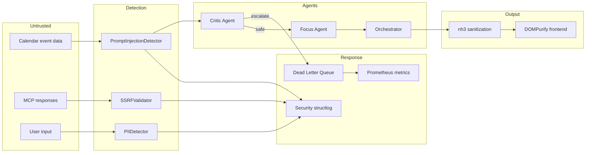
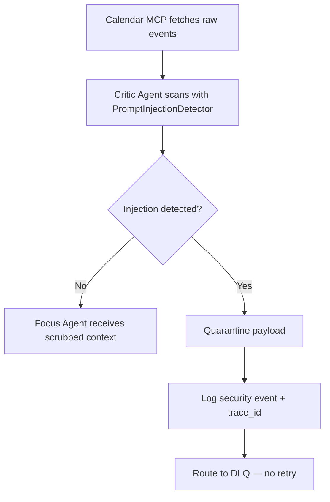
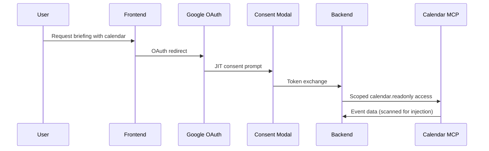

# Security & OWASP GenAI Hardening

**Enterprise security posture for the AI Daily Briefing Assistant** — defense-in-depth controls for multi-agent LLM pipelines, MCP integrations, and production deployment.

[](https://owasp.org/www-project-top-10-for-large-language-model-applications/)
[](https://www.python.org/)
[](https://fastapi.tiangolo.com/)
[](../backend/tests/security/)
[](https://docs.sigstore.dev/)

**Version:** 1.6.0 · **Last updated:** May 2026 · [← Back to README](../README.md)

---

## At a Glance

| Dimension | Summary |
|-----------|---------|
| **Framework** | [OWASP GenAI Top 10](https://owasp.org/www-project-top-10-for-large-language-model-applications/) — LLM01–LLM08 implemented with automated tests |
| **Threat focus** | Indirect prompt injection via calendar invites, insecure LLM output, model DoS, MCP SSRF, PII leakage |
| **Architecture pattern** | Orchestrator-as-Presenter — only sanitized markdown reaches users; agents return strict JSON envelopes |
| **Controls** | Regex injection detector, nh3 + DOMPurify sanitization, per-agent token budgets, SlowAPI rate limits, SSRF allowlists |
| **Verification** | 8 dedicated security test modules + E2E security scenarios; CI runs Ruff, MyPy, and full pytest suite |
| **Production** | Cosign-signed container images, structured security logging, DLQ for security escalations, Prometheus violation metrics |

---

## Security Technology Stack

Plain-text keyword block for ATS and recruiter search:

```
OWASP GenAI Top 10, LLM01 prompt injection, LLM02 insecure output handling, LLM04 model denial of service,
LLM05 supply chain security, LLM06 sensitive information disclosure, LLM07 insecure plugin design,
LLM08 excessive agency, defense in depth, zero-trust input, least privilege, fail secure,
Python 3.12, FastAPI, Pydantic v2, LangGraph multi-agent, Model Context Protocol (MCP),
PromptInjectionDetector, PIIDetector, SSRFValidator, nh3 HTML sanitization, DOMPurify,
slowapi rate limiting, circuit breaker, token budget enforcement, structlog security events,
OpenTelemetry, Prometheus security metrics, dead letter queue (DLQ), OAuth 2.0 JIT consent,
read-only SQL, row-level security, uv.lock dependency pinning, Cosign, Sigstore, GitHub Actions CI
```

### By layer

| Layer | Security technologies & patterns |
|-------|----------------------------------|
| **Agent graph** | Critic injection scanning, token budget circuit breaker, scoped MCP access, consent-gated calendar |
| **Backend API** | SlowAPI rate limits, Pydantic strict schemas, `AgentResultEnvelope` escalation protocol |
| **Output path** | nh3 allowlist sanitization (`backend/security/sanitization.py`), Orchestrator-as-Presenter |
| **Frontend** | DOMPurify client-side sanitization, Zod validation, no raw agent JSON in UI |
| **MCP / integrations** | SSRF allowlist (`*.googleapis.com`), private IP blocking, read-only PostgreSQL MCP |
| **Privacy** | PII detection/masking, data classification routing, local LLM fallback for `confidential_pii` |
| **Observability** | `structlog` security channel, trace_id propagation, DLQ persistence, Prometheus counters |
| **Supply chain** | `uv.lock` pinning, CI dependency checks, Cosign keyless image signing |

---

## Security Principles

1. **Zero-Trust Input** — All external data (calendar invites, MCP payloads, user text) is untrusted until validated
2. **Defense in Depth** — Detection, sanitization, rate limits, and circuit breakers stack; no single control is sufficient
3. **Least Privilege** — Agents have minimal MCP permissions; Calendar is read-only; PostgreSQL is read-only with RLS
4. **Fail Secure** — Security failures deny access, escalate to DLQ, and never auto-retry
5. **Audit Everything** — Security events log with `trace_id`, agent context, and actionable metadata

---

## OWASP GenAI Top 10 Compliance Matrix

| ID | Vulnerability | Status | Mitigation | Test coverage |
|----|---------------|--------|------------|---------------|
| **LLM01** | Prompt Injection | ✅ Implemented | Critic agent + `PromptInjectionDetector`, Unicode normalization, DLQ escalation | [`test_injection.py`](../backend/tests/security/test_injection.py) |
| **LLM02** | Insecure Output Handling | ✅ Implemented | nh3 allowlist sanitization, Orchestrator-as-Presenter, DOMPurify on frontend | [`test_sanitization.py`](../backend/tests/security/test_sanitization.py) |
| **LLM03** | Training Data Poisoning | ⬜ N/A | No custom model training; third-party models only | N/A |
| **LLM04** | Model Denial of Service | ✅ Implemented | Per-agent token budgets (2× hard limit), graph circuit breaker, SlowAPI rate limits | [`test_token_budget.py`](../backend/tests/security/test_token_budget.py), [`test_rate_limits.py`](../backend/tests/security/test_rate_limits.py) |
| **LLM05** | Supply Chain Vulnerabilities | ✅ Implemented | `uv.lock` pinning, CI dependency audit, Cosign-signed Docker images | [`test_dependencies.py`](../backend/tests/security/test_dependencies.py) |
| **LLM06** | Sensitive Information Disclosure | ✅ Implemented | `PIIDetector`, structlog masking, LLM payload masking, classification-based routing | [`test_pii_masking.py`](../backend/tests/security/test_pii_masking.py) |
| **LLM07** | Insecure Plugin Design | ✅ Implemented | MCP allowlists, `SSRFValidator`, read-only SQL, private IP blocking | [`test_mcp_security.py`](../backend/tests/security/test_mcp_security.py) |
| **LLM08** | Excessive Agency | ✅ Implemented | Agent scope budgets, MCP boundaries, consent-gated external access | [`test_agent_scope.py`](../backend/tests/security/test_agent_scope.py) |
| **LLM09** | Overreliance | ⬜ N/A | UX guidance (out of scope for backend security) | N/A |
| **LLM10** | Model Theft | ⬜ N/A | No proprietary models hosted | N/A |

**E2E validation:** [`backend/tests/e2e/test_security_scenarios.py`](../backend/tests/e2e/test_security_scenarios.py)

**Prompt guardrails:** [`prompts/security/`](../prompts/security/) — versioned contracts, guardrails, and tool policies

---

## Security Architecture



**Module map:** `backend/security/` — `injection.py`, `sanitization.py`, `pii.py`, `ssrf.py`, `token_budget.py`, `rate_limit.py`

---

## Prompt Injection Defense (LLM01)

### Threat model

Calendar events created by third parties are primary vectors for **indirect prompt injection**. A malicious actor can embed instructions in event titles or descriptions that attempt to override LLM system prompts.

### Detection pipeline



### Detection patterns

Implemented in `backend/security/injection.py` with Unicode normalization and confidence scoring:

| Pattern name | Example signature | Confidence |
|--------------|-------------------|------------|
| `ignore_previous` | `ignore previous` | 0.95 |
| `disregard_training` | `disregard training` | 0.95 |
| `debug_mode` | `debug mode` | 0.90 |
| `system_brackets` | `[[SYSTEM]]` | 0.98 |
| `im_start` | `<\|im_start\|>` | 0.98 |
| `code_system` | ` ```system ` | 0.92 |

### Escalation protocol

When injection is detected:

1. **Quarantine** — Payload is immediately quarantined; unsafe content does not propagate
2. **Log** — Security event logged with full context and `trace_id`
3. **Escalate** — `AgentResultEnvelope.escalation.reason = "security_violation_detected"`
4. **No retry** — Security violations are never retried automatically
5. **DLQ** — Event persisted for security team review

```json
{
  "agent_id": "critic",
  "status": "escalated",
  "escalation": {
    "reason": "security_violation_detected",
    "target_agent": "orchestrator",
    "context": "Indirect prompt injection in calendar event 'Team Sync': pattern matched 'ignore previous'"
  }
}
```

---

## Output Sanitization (LLM02)

### Orchestrator-as-Presenter pattern

Only the Orchestrator produces user-facing content. All other agents return **strict JSON** via `AgentResultEnvelope`:

| Agent | Output format | UI rendering |
|-------|---------------|--------------|
| Task Agent | JSON (task list) | ❌ Never directly |
| Calendar Agent | JSON (events) | ❌ Never directly |
| Focus Agent | JSON (plan) | ❌ Never directly |
| Critic Agent | JSON (review) | ❌ Never directly |
| **Orchestrator** | Sanitized markdown/HTML | ✅ After nh3 sanitization |

### Backend sanitization (Python)

`backend/security/sanitization.py` uses **nh3** with an explicit tag/attribute allowlist:

```python
import nh3

ALLOWED_TAGS = frozenset({
    "p", "h1", "h2", "h3", "h4", "h5", "h6",
    "ul", "ol", "li", "strong", "em", "code", "pre",
    "blockquote", "hr", "br", "a",
})
ALLOWED_ATTRIBUTES: dict[str, set[str]] = {"a": {"href", "title"}}

def sanitize_markdown(content: str) -> str:
    return nh3.clean(content, tags=ALLOWED_TAGS, attributes=ALLOWED_ATTRIBUTES)
```

Stripped content triggers a structured `sanitization_stripped_content` security log entry.

### Frontend sanitization (TypeScript)

Defense-in-depth on the client with DOMPurify:

```typescript
import DOMPurify from 'dompurify';

const DOMPURIFY_CONFIG = {
  ALLOWED_TAGS: ['p', 'h1', 'h2', 'h3', 'ul', 'ol', 'li', 'strong', 'em', 'code', 'pre', 'a'],
  ALLOWED_ATTR: ['href', 'title'],
  KEEP_CONTENT: true,
};

export function sanitizeHtml(dirty: string): string {
  return DOMPurify.sanitize(dirty, DOMPURIFY_CONFIG);
}
```

---

## Denial of Wallet Protection (LLM04)

### Token budget enforcement

Per-agent budgets in `backend/security/token_budget.py`. Exceeding **2× budget** triggers a graph circuit breaker (`token_budget_exceeded` → DLQ):

| Agent | Token budget | Hard limit (2×) |
|-------|--------------|-----------------|
| Task Agent | 3,000 | 6,000 |
| Calendar Agent | 3,000 | 6,000 |
| Focus Agent | 6,000 | 12,000 |
| Critic Agent | 5,000 | 10,000 |

Utilization is exported to Prometheus via `set_token_budget_utilization`.

### Circuit breaker

```python
HARD_LIMIT_MULTIPLIER = 2

def evaluate_token_budget(state: BriefingGraphState) -> CircuitBreakReason:
    for agent_id, budget in AGENT_TOKEN_BUDGETS.items():
        used = _agent_tokens_used(state, agent_id)
        if used > budget * HARD_LIMIT_MULTIPLIER:
            return "token_budget_exceeded"
    return "none"
```

### Rate limiting (SlowAPI)

Centralized in `backend/security/rate_limit.py` with structured 429 responses and security logging:

| Endpoint | Rate limit | Window |
|----------|------------|--------|
| `/api/v1/briefing/generate` | 10 requests | 1 minute |
| `/api/v1/tasks/*` (default) | 60 requests | 1 minute |
| `/api/v1/export` | 5 requests | 1 hour |

Violations emit `rate_limit_exceeded` events with endpoint, client host, and `Retry-After` header.

---

## MCP Security (LLM07)

### PostgreSQL MCP

| Control | Implementation |
|---------|----------------|
| **Access scope** | Read-only for Task Agent |
| **Row-level security** | `user_id` filter on all queries |
| **Query validation** | Parameterized queries only |
| **Connection** | Local TCP; no external exposure |

### Google Calendar MCP

| Control | Implementation |
|---------|----------------|
| **SSRF defense** | `SSRFValidator` — allowlist `*.googleapis.com`, block private/reserved IPs |
| **Token scope** | `calendar.readonly` only |
| **Consent** | JIT authorization with time-bounded consent records |
| **Input sanitization** | All event data scanned by Critic / injection detector |

```python
DEFAULT_ALLOWLIST: tuple[str, ...] = ("*.googleapis.com",)

class SSRFValidator:
    def validate_url(self, url: str, *, source: str = "mcp") -> None:
        # Blocks invalid schemes, private IPs, and non-allowlisted hosts
        ...
```

Blocked requests increment Prometheus security violation counters.

---

## Agent Scope Boundaries (LLM08)

| Agent | Permitted actions | Prohibited actions |
|-------|-------------------|--------------------|
| Task Agent | Read tasks, read preferences | Write, delete, external API |
| Calendar Agent | Read calendar (with consent) | Write, delete, non-Google API |
| Focus Agent | Generate text from context | Any tool/MCP access |
| Critic Agent | Evaluate text, security scan | Any tool/MCP access |
| Orchestrator | Coordinate, synthesize, present | Direct external API calls |

Token budgets enforce computational scope; MCP clients enforce data access scope.

---

## Sensitive Data & PII (LLM06)

### Data classification

| Classification | Description | Handling |
|----------------|-------------|----------|
| `public` | Non-sensitive metadata | Standard logging |
| `internal` | System operational data | Masked in external logs |
| `confidential` | Business-sensitive content | Encrypted at rest (production target) |
| `confidential_pii` | Personal identifiable information | Masked; local LLM when enabled; else masked OpenRouter |

### PII detection & masking

`PIIDetector` in `backend/security/pii.py` detects and masks:

| PII type | Mask token |
|----------|------------|
| Email | `[REDACTED_EMAIL]` |
| Phone | `[REDACTED_PHONE]` |
| SSN | `[REDACTED_SSN]` |
| Credit card | `[REDACTED_CARD]` |

`AgentResultEnvelope` validates metadata and applies PII checks before external LLM calls. When classification is `confidential_pii`, the LLM router (`backend/llm/router.py`):

1. Uses **local LLM** if `LOCAL_LLM_ENABLED=true` and the server is reachable
2. Falls back to **masked OpenRouter** if local LLM is disabled or unreachable (PII masked via `mask_pii()` before outbound calls)

In Docker, `LOCAL_LLM_BASE_URL=http://localhost:8080` points at the container — use `http://host.docker.internal:8080/v1` to reach a host-side model, or set `LOCAL_LLM_ENABLED=false` for OpenRouter-only dev.

```python
from backend.security.pii import PIIDetector, mask_pii

detector = PIIDetector()
if detector.contains_pii(user_content):
    safe_payload = mask_pii(user_content)
```

---

## Supply Chain Security (LLM05)

| Control | Implementation |
|---------|----------------|
| **Dependency pinning** | `uv.lock` — reproducible installs |
| **CI audit** | GitHub Actions dependency and lint gates |
| **Container signing** | Cosign keyless signing on GHCR publish |
| **Image verification** | `cosign verify` with GitHub OIDC issuer before deploy |

See [infrastructure/DEPLOYMENT.md](../infrastructure/DEPLOYMENT.md) for verify-and-deploy workflow.

---

## Cryptographic Standards

| Use case | Algorithm | Notes |
|----------|-----------|-------|
| JWT signing | RS256 | 2048-bit RSA (production target) |
| Password hashing | Argon2id | Default params (production target) |
| At-rest encryption | AES-256-GCM | 256-bit keys (production target) |
| TLS | TLS 1.3 | Terminated at Nginx in production container |

---

## Authentication & Authorization

### OAuth 2.0 flow (Google Calendar)



### Session management (production target)

- HTTP-only, Secure, SameSite=Strict cookies
- Session token rotation on privilege escalation
- Absolute timeout: 24 hours · Idle timeout: 4 hours

---

## Security Event Logging

All security events use the dedicated `structlog` security channel (`get_security_logger()`):

```python
get_security_logger().warning(
    "prompt_injection_detected",
    trace_id=trace_id,
    agent_id="critic",
    pattern_matched="ignore_previous",
    action_taken="quarantine_and_dlq",
)
```

**Event types:** `prompt_injection_detected`, `sanitization_stripped_content`, `rate_limit_exceeded`, SSRF blocks, token budget violations.

**Correlation:** Every API request carries a `trace_id` propagated through agents, logs, and DLQ entries.

---

## Automated Test Coverage

| Module | Validates |
|--------|-----------|
| `test_injection.py` | Pattern matching, normalization, escalation |
| `test_sanitization.py` | nh3 allowlist, script stripping, logging |
| `test_pii_masking.py` | Detection, masking, envelope integration |
| `test_mcp_security.py` | SSRF allowlist, private IP blocking |
| `test_token_budget.py` | Budget thresholds, circuit breaker |
| `test_rate_limits.py` | SlowAPI 429 responses, headers |
| `test_agent_scope.py` | Agent budget boundaries |
| `test_dependencies.py` | Lockfile integrity, known CVE patterns |
| `test_security_scenarios.py` (E2E) | End-to-end injection and escalation flows |

Run locally:

```bash
uv run pytest backend/tests/security/ backend/tests/e2e/test_security_scenarios.py -v
```

---

## Incident Response

### Severity levels

| Level | Description | Response time |
|-------|-------------|---------------|
| **P1 Critical** | Active exploitation, data breach | Immediate |
| **P2 High** | Vulnerability with exploit potential | 4 hours |
| **P3 Medium** | Security misconfiguration | 24 hours |
| **P4 Low** | Minor security improvement | Next sprint |

### Response checklist

- [ ] Identify and contain the incident
- [ ] Preserve evidence (logs, DLQ entries, trace_ids)
- [ ] Assess impact and scope
- [ ] Remediate vulnerability
- [ ] Notify affected users if required
- [ ] Post-incident review

---

## Related Documentation

| Document | Purpose |
|----------|---------|
| [README.md](../README.md) | Project overview, tech stack, quick start |
| [docs/ARCHITECTURE.md](ARCHITECTURE.md) | System design and agent roles |
| [docs/OBSERVABILITY.md](OBSERVABILITY.md) | Tracing, metrics, SLOs |
| [infrastructure/DEPLOYMENT.md](../infrastructure/DEPLOYMENT.md) | Production rollout, Cosign verify |
| [prompts/security/](../prompts/security/) | Agent security prompt contracts |
| [AGENT.md](../AGENT.md) | Engineering workflow and conventions |

---

*Security Documentation — Version 1.6.0 — May 2026*
