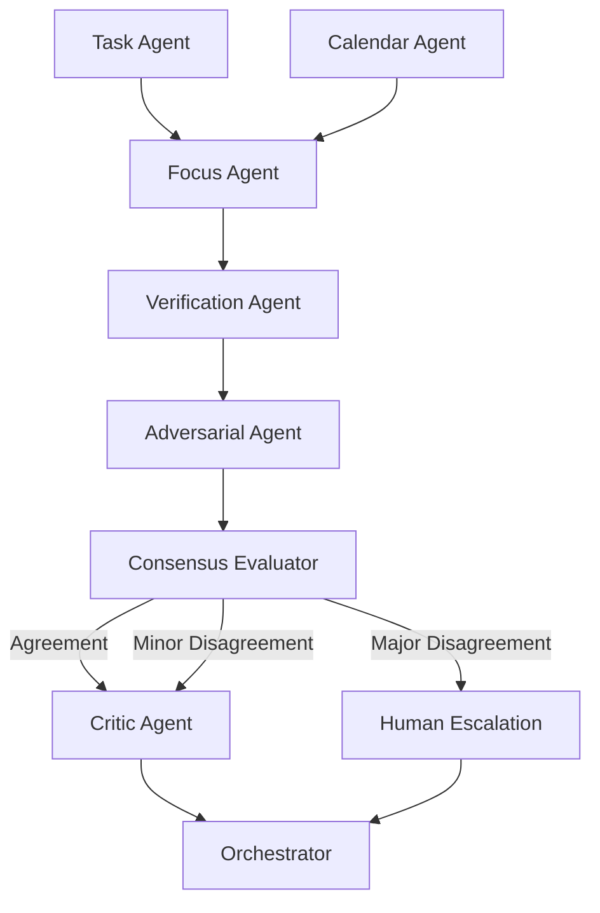

# Week 1 Implementation Guide — Critical Gap Remediation

**Target:** Address P0 gaps and establish foundation for production readiness  
**Duration:** 5 days (40 hours)  
**Prerequisites:** Review `docs/GAP-ANALYSIS-REVIEW.md` and `docs/PROPOSAL-REVIEW-SUMMARY.md`

**⚠️ CRITICAL:** This guide must be executed following `AGENT.md` and `docs/EXECUTION-RULES.md` protocols.

---

## 🎯 Implementation Protocol (READ FIRST)

### Before Starting Any Implementation

**Mandatory Reading Order:**
1. ✅ `AGENT.md` — Root workflow rules
2. ✅ `docs/EXECUTION-RULES.md` — Production-ready code requirements
3. ✅ `docs/TOKEN-EFFICIENCY.md` — Context management
4. ✅ `docs/tasks/lessons.md` — Avoid repeating past mistakes
5. ✅ `backend/AGENT.md` — Backend agent rules
6. ✅ `docs/ENGINEERING-STANDARDS.md` — Coding standards
7. ✅ `docs/example-code/` — Reference implementations

### Git Branch Workflow (Per EXECUTION-RULES.md §9)

```bash
# Create epic branch from integration branch
git checkout epic/autonomus-implementation-gap
git pull origin epic/autonomus-implementation-gap
git checkout -b epic/week1-gap-remediation
git push -u origin epic/week1-gap-remediation
```

### Task Planning Protocol (Per EXECUTION-RULES.md §2)

**BEFORE touching any code, write implementation plan to `docs/tasks/todo.md`:**

```markdown
# Week 1 Implementation — Critical Gap Remediation

## Epic: Gap Analysis Remediation (Week 1)
Branch: epic/week1-gap-remediation
Status: in_progress

### Day 1: Drift Detection & Observability
- [ ] Update backend/schemas/envelope.py with violation tracking
- [ ] Create backend/observability/metrics.py
- [ ] Write tests: backend/tests/observability/test_drift_detection.py
- [ ] Verify: All tests pass with actual metrics (not mocked)

### Day 2: NHI Registry Foundation
- [ ] Create docs/NHI-OBSERVABILITY.md
- [ ] Create backend/security/nhi_registry.py
- [ ] Write tests: backend/tests/security/test_nhi.py
- [ ] Verify: Registry persists and retrieves correctly

### Day 3: Verification Agent Design
- [ ] Create backend/agents/verification/AGENT.md
- [ ] Create backend/agents/adversarial/AGENT.md
- [ ] Review existing agents' AGENT.md for consistency
- [ ] Verify: AGENT.md files complete with all required sections

### Day 4: Consensus Model Implementation
- [ ] Update backend/graph/builder.py with consensus workflow
- [ ] Create backend/agents/consensus/node.py
- [ ] Create backend/agents/verification/node.py (stub)
- [ ] Create backend/agents/adversarial/node.py (stub)
- [ ] Verify: Graph compiles without errors

### Day 5: Testing & Documentation
- [ ] Write integration tests: backend/tests/architecture/test_consensus.py
- [ ] Update docs/ARCHITECTURE.md
- [ ] Create docs/learning/week1-consensus-pattern.md
- [ ] Update docs/tasks/lessons.md with learnings
- [ ] Verify: All tests pass, documentation complete

## Verification Gates
- ✅ Each day's tests must pass before proceeding
- ✅ No pseudo-code allowed — only production-ready implementations
- ✅ All metrics must be wired to actual telemetry (not hardcoded)
- ✅ Each agent must return AgentResultEnvelope

## Checkpoint Protocol
- At ~75% context: Write to docs/tasks/checkpoint.md
- Commit WIP: git commit -m "WIP: checkpoint at Day N"
```

### Lessons Learning Protocol (Per EXECUTION-RULES.md §2.5)

After each day, append learnings to `docs/tasks/lessons.md`:

```markdown
## Week 1 — Gap Remediation Learnings

### Day 1: [Date]
- **Lesson:** [What was learned or corrected]
- **Root Cause:** [Why the issue occurred]
- **New Rule:** [How to avoid in future]
```

---

## 📝 Coding Standards Reference

All code examples in this guide follow the standards defined in `docs/example-code/examples/s*.md`. Key patterns:

### Type Hints (Strict Required)
- ✅ Use modern syntax: `str | None` (not `Optional[str]`)
- ✅ Use `list[T]`, `dict[K, V]` (not uppercase `List`, `Dict`)
- ✅ All functions must have parameter and return type annotations
- ✅ Use PEP 695 generics for Python 3.12+ (`def func[T](x: T) -> T`)

### Docstrings (Required for All Definitions)
- ✅ Every function, class, method, and property needs a docstring
- ✅ Module-level docstrings explain purpose and context
- ✅ Use imperative mood for function docstrings
- ✅ Include Args, Returns, Raises sections for complex functions

### Pydantic v2 Patterns
- ✅ Use `ConfigDict` (not `class Config:`)
- ✅ Use `model_dump()` (not `.dict()`)
- ✅ Use `model_dump_json()` (not `.json()`)
- ✅ Use `SecretStr` for passwords and tokens
- ✅ Use `from_attributes=True` for ORM mapping
- ✅ Use `Field(..., description="...")` for all model fields

### Import Organization
- ✅ Standard library first (sorted alphabetically)
- ✅ Third-party packages next (sorted)
- ✅ Local imports last (sorted)
- ✅ Use explicit imports from `typing` (e.g., `from typing import Literal`)

### Error Handling
- ✅ Never catch generic `Exception` — use specific types
- ✅ Use try/except/else/finally appropriately
- ✅ Async exceptions handled identically to sync

### Testing Patterns
- ✅ Test functions use `-> None` return type
- ✅ Descriptive test names explain what is being tested
- ✅ Docstrings explain the validation logic
- ✅ Use pytest fixtures for common setup
- ✅ Use `pytest.raises(Exception)` for validation error tests

### Async Patterns
- ✅ Use `async def` for all async functions
- ✅ Use `asyncio.gather()` for concurrent tasks
- ✅ Use `async with` for async context managers
- ✅ Always `await` coroutines (never leave dangling)

**Reference:** See `docs/example-code/examples/s*.md` for comprehensive examples.

---

## Day 1: Drift Detection & Observability (Gap #99) ✅ Partial

**Status:** Alerting rules defined in `docs/OBSERVABILITY.md`, code implementation required.

### Morning (4 hours): Update Backend Schemas

**File:** `backend/schemas/envelope.py`

Add violation tracking to `ExecutionMetadata`:

```python
"""Agent envelope schemas with guardrail violation tracking.

This module extends the existing AgentResultEnvelope schema to support
rogue agent drift detection (OWASP Agent #10).
"""

from datetime import datetime, timezone
from typing import Literal

from pydantic import BaseModel, ConfigDict, Field


class GuardrailViolation(BaseModel):
    """Guardrail violation metadata attached to agent envelopes.
    
    Tracks individual violations for drift detection and security monitoring.
    Used by Prometheus metrics and structured logging.
    """
    
    model_config = ConfigDict(strict=True, frozen=True)
    
    violation_type: str = Field(
        ...,
        description="Type of violation detected (e.g., prompt_injection_detected)",
    )
    severity: Literal["low", "medium", "high", "critical"] = Field(
        ...,
        description="Violation severity level for alerting",
    )
    confidence: float = Field(
        ...,
        ge=0.0,
        le=1.0,
        description="Confidence score from detection algorithm",
    )
    matched_pattern: str | None = Field(
        default=None,
        description="Regex pattern or signature that triggered detection",
    )
    context_snippet: str | None = Field(
        default=None,
        max_length=200,
        description="Truncated context showing where violation occurred",
    )
    timestamp: datetime = Field(
        default_factory=lambda: datetime.now(timezone.utc),
        description="When the violation was detected",
    )


class ExecutionMetadata(BaseModel):
    """Execution telemetry attached to every agent response.
    
    Extended in Gap #99 to track guardrail violations for drift detection.
    All agents must return this metadata structure.
    """
    
    model_config = ConfigDict(strict=True, frozen=True)
    
    execution_ms: int = Field(
        ...,
        ge=0,
        le=300_000,
        description="Execution time in milliseconds",
    )
    tokens_used: int = Field(
        ...,
        ge=0,
        le=128_000,
        description="Total tokens consumed (input + output)",
    )
    model_used: str = Field(
        ...,
        min_length=1,
        description="LLM model identifier (e.g., openai/gpt-4o-mini)",
    )
    prompt_version: str = Field(
        ...,
        pattern=r"^v\d+\.\d+\.\d+$",
        description="Semantic version of the prompt used",
    )
    trace_id: str = Field(
        ...,
        min_length=32,
        max_length=64,
        description="OpenTelemetry trace ID for correlation",
    )
    data_classification: Literal[
        "public",
        "internal",
        "confidential",
        "confidential_pii",
    ] = Field(
        ...,
        description="Data classification level for routing decisions",
    )
    
    # NEW: Violation tracking (Gap #99 — Rogue Agent Drift Detection)
    guardrail_violations: list[GuardrailViolation] = Field(
        default_factory=list,
        description="List of violations detected during agent execution",
    )
    violation_count: int = Field(
        default=0,
        ge=0,
        description="Total count of violations (cached for performance)",
    )
```

### Afternoon (4 hours): Implement Observability Layer

**File:** Create `backend/observability/metrics.py`

```python
"""Observability metrics for AI Daily Briefing Assistant.

This module defines Prometheus metrics for monitoring agent behavior,
including rogue agent drift detection (Gap #99).

All metrics follow the naming convention: {namespace}_{metric}_{unit}
"""

import structlog
from prometheus_client import Counter, Gauge, Histogram

logger = structlog.get_logger()

# Guardrail violation counter (Gap #99 — Rogue Agent Drift Detection)
GUARDRAIL_VIOLATIONS = Counter(
    name="guardrail_violations_total",
    documentation="Guardrail violations by agent and type for drift detection",
    labelnames=["agent_id", "violation_type", "severity"],
)

# Existing metrics (extended for completeness)
BRIEFING_DURATION = Histogram(
    name="briefing_generation_duration_seconds",
    documentation="Time to generate briefing from request to response",
    labelnames=["status", "degraded"],
    buckets=[0.5, 1, 2, 5, 10, 30, 60],
)

AGENT_DURATION = Histogram(
    name="agent_execution_duration_seconds",
    documentation="Per-agent execution time in the LangGraph workflow",
    labelnames=["agent_id", "role", "status"],
    buckets=[0.1, 0.5, 1, 2, 5, 10],
)

AGENT_EXECUTIONS = Counter(
    name="agent_executions_total",
    documentation="Total agent executions for success rate calculation",
    labelnames=["agent_id", "role", "status"],
)


def log_guardrail_violation(
    trace_id: str,
    agent_id: str,
    violation: "GuardrailViolation",  # Forward reference to avoid circular import
) -> None:
    """Log guardrail violation with structured context and increment Prometheus counter.
    
    This function is the central point for violation reporting. It:
    1. Logs to structlog with full context for debugging
    2. Increments Prometheus counter for alerting
    3. Tags with OWASP Agent #10 for security tracking
    
    Args:
        trace_id: OpenTelemetry trace ID for correlation
        agent_id: Agent that detected the violation
        violation: Violation details from GuardrailViolation model
    
    Example:
        >>> from backend.schemas.envelope import GuardrailViolation
        >>> violation = GuardrailViolation(
        ...     violation_type="prompt_injection_detected",
        ...     severity="critical",
        ...     confidence=0.95,
        ...     matched_pattern="ignore_previous",
        ... )
        >>> log_guardrail_violation("trace123", "critic", violation)
    """
    logger.warning(
        "guardrail_violation_detected",
        trace_id=trace_id,
        agent_id=agent_id,
        violation_type=violation.violation_type,
        severity=violation.severity,
        confidence=violation.confidence,
        matched_pattern=violation.matched_pattern,
        owasp_id="agent_10",
    )
    
    # Increment Prometheus counter for drift detection alerts
    GUARDRAIL_VIOLATIONS.labels(
        agent_id=agent_id,
        violation_type=violation.violation_type,
        severity=violation.severity,
    ).inc()
```

**File:** Create `backend/observability/__init__.py`

```python
from .metrics import (
    GUARDRAIL_VIOLATIONS,
    BRIEFING_DURATION,
    AGENT_DURATION,
    log_guardrail_violation,
)

__all__ = [
    "GUARDRAIL_VIOLATIONS",
    "BRIEFING_DURATION",
    "AGENT_DURATION",
    "log_guardrail_violation",
]
```

### Testing (2 hours) — VERIFICATION GATE ⚠️

**File:** Create `backend/tests/observability/test_drift_detection.py`

**⚠️ EXECUTION RULE:** Do NOT proceed to Day 2 until these tests PASS with actual proof (test output logs).

```python
"""Tests for rogue agent drift detection (Gap #99).

Validates that guardrail violations are properly logged and counted
for drift detection alerting.
"""

import pytest

from backend.observability.metrics import GUARDRAIL_VIOLATIONS, log_guardrail_violation
from backend.schemas.envelope import ExecutionMetadata, GuardrailViolation


def test_guardrail_violation_logging() -> None:
    """Test that violations are logged and Prometheus counter increments.
    
    Ensures the log_guardrail_violation function:
    1. Logs to structlog with correct fields
    2. Increments Prometheus counter with correct labels
    """
    violation = GuardrailViolation(
        violation_type="prompt_injection_detected",
        severity="critical",
        confidence=0.95,
        matched_pattern="ignore_previous",
    )
    
    # Get initial counter value
    initial_count = GUARDRAIL_VIOLATIONS.labels(
        agent_id="critic",
        violation_type="prompt_injection_detected",
        severity="critical",
    )._value.get()
    
    # Log violation
    log_guardrail_violation(
        trace_id="test_trace_123",
        agent_id="critic",
        violation=violation,
    )
    
    # Verify counter incremented
    final_count = GUARDRAIL_VIOLATIONS.labels(
        agent_id="critic",
        violation_type="prompt_injection_detected",
        severity="critical",
    )._value.get()
    
    assert final_count == initial_count + 1


def test_execution_metadata_with_violations() -> None:
    """Test ExecutionMetadata includes violation tracking fields.
    
    Validates the schema extension for Gap #99.
    """
    metadata = ExecutionMetadata(
        execution_ms=1234,
        tokens_used=512,
        model_used="openai/gpt-4o-mini",
        prompt_version="v1.5.0",
        trace_id="test_trace_456",
        data_classification="internal",
        guardrail_violations=[
            GuardrailViolation(
                violation_type="token_budget_exceeded",
                severity="high",
                confidence=1.0,
            ),
        ],
        violation_count=1,
    )
    
    assert metadata.violation_count == 1
    assert len(metadata.guardrail_violations) == 1
    assert metadata.guardrail_violations[0].violation_type == "token_budget_exceeded"


def test_guardrail_violation_immutability() -> None:
    """Test that GuardrailViolation is frozen (immutable).
    
    Ensures violations cannot be modified after creation.
    """
    violation = GuardrailViolation(
        violation_type="unauthorized_tool_access",
        severity="critical",
        confidence=1.0,
    )
    
    with pytest.raises(Exception):  # Pydantic raises ValidationError on frozen model mutation
        violation.severity = "low"  # type: ignore[misc]


def test_execution_metadata_immutability() -> None:
    """Test that ExecutionMetadata is frozen (immutable).
    
    Ensures metadata cannot be modified after agent returns envelope.
    """
    metadata = ExecutionMetadata(
        execution_ms=1000,
        tokens_used=100,
        model_used="openai/gpt-4o",
        prompt_version="v1.0.0",
        trace_id="test_trace",
        data_classification="public",
    )
    
    with pytest.raises(Exception):  # Pydantic raises ValidationError on frozen model mutation
        metadata.tokens_used = 200  # type: ignore[misc]


def test_violation_confidence_bounds() -> None:
    """Test that violation confidence is constrained to [0.0, 1.0].
    
    Pydantic validation should reject values outside this range.
    """
    # Valid confidence values
    GuardrailViolation(
        violation_type="test",
        severity="low",
        confidence=0.0,
    )
    GuardrailViolation(
        violation_type="test",
        severity="low",
        confidence=1.0,
    )
    
    # Invalid confidence values should raise ValidationError
    with pytest.raises(Exception):
        GuardrailViolation(
            violation_type="test",
            severity="low",
            confidence=1.5,
        )
    
    with pytest.raises(Exception):
        GuardrailViolation(
            violation_type="test",
            severity="low",
            confidence=-0.1,
        )
```

Run: `uv run pytest backend/tests/observability/test_drift_detection.py -v`

**Verification Proof Required:**
```bash
# Capture test output
uv run pytest backend/tests/observability/test_drift_detection.py -v > logs/day1-test-output.txt

# Verify metrics are wired (not mocked)
# Check that GUARDRAIL_VIOLATIONS counter actually increments
```

**Before Proceeding to Day 2:**
1. ✅ All 7 tests pass
2. ✅ Prometheus counter increments with actual values (inspect `_value.get()`)
3. ✅ Update `docs/tasks/todo.md` — mark Day 1 complete
4. ✅ Update `docs/tasks/lessons.md` with any corrections or insights
5. ✅ Commit: `git commit -m "Day 1: Drift detection implementation with tests"`

---

## Day 2: NHI Registry Foundation (Gaps #92-93)

**Goal:** Establish non-human identity tracking for all agents.

### Morning (4 hours): Design NHI Registry

**File:** Create `docs/NHI-OBSERVABILITY.md`

```markdown
# Non-Human Identity (NHI) Observability

## Overview

All AI agents are registered as non-human identities with unique IDs, audit trails, and security posture tracking.

## NHI Definition-of-Done (Pre-Merge Gate)

Before merging any PR that adds or modifies an agent:

1. [ ] Agent registered in `backend/security/nhi_registry.py`
2. [ ] Unique NHI ID assigned (format: `nhi_{agent_name}_{version}`)
3. [ ] Secrets/credentials consolidated (no hardcoded secrets)
4. [ ] External connections documented (MCP servers, APIs)
5. [ ] Risk assessment completed (capability × risk matrix)
6. [ ] Audit trail configured (all actions logged with NHI ID)

## NHI Registry Schema

```python
class NHIRecord(BaseModel):
    nhi_id: str  # e.g., "nhi_calendar_agent_v1"
    agent_name: str
    version: str
    capability_level: Literal["low", "high"]
    risk_level: Literal["low", "high"]
    lifecycle: Literal["ephemeral", "persistent"]
    access_model: Literal["static", "dynamic"]
    registered_at: datetime
    registered_by: str  # Engineer/system that registered
    external_connections: list[str]  # ["google_calendar_mcp", "postgres_mcp"]
    secrets_manager: str  # "vault", "env", "none"
```

## Capability × Risk Matrix

| Capability | Risk | HITL Required | Access Model | Example |
|------------|------|---------------|--------------|---------|
| Low | Low | No | Static | Task reader (read-only DB) |
| Low | High | Yes | Static | Finance data reader (PII) |
| High | Low | No | Dynamic | Style guide editor (non-sensitive) |
| High | High | Yes | Dynamic | Calendar agent (external API + PII) |

## Audit Requirements

Every NHI action must log:
- `nhi_id`
- `trace_id`
- `action` (tool_called, mcp_invoked, llm_requested)
- `target` (resource accessed)
- `outcome` (success, failure, escalated)
- `user_context` (on-behalf-of user)
```

### Afternoon (4 hours): Implement NHI Registry

**File:** Create `backend/security/nhi_registry.py`

```python
"""Non-Human Identity (NHI) Registry for AI agents.

Tracks all agents as non-human identities with unique IDs, capability
assessment, and security posture tracking (Gap #92-93).

All agents must be registered before deployment. Pre-merge validation
ensures no unregistered agents reach production.
"""

import json
from datetime import datetime, timezone
from pathlib import Path
from typing import Literal

from pydantic import BaseModel, Field


class NHIRecord(BaseModel):
    """Non-human identity record for AI agents.
    
    Each agent requires a unique NHI ID following the pattern:
    nhi_{agent_name}_v{version} (e.g., nhi_calendar_agent_v1)
    
    The capability × risk matrix determines HITL requirements and
    access model (static vs dynamic credentials).
    """
    
    nhi_id: str = Field(
        ...,
        pattern=r"^nhi_[a-z_]+_v\d+$",
        description="Unique identifier following nhi_{name}_v{version} pattern",
    )
    agent_name: str = Field(
        ...,
        description="Human-readable agent name (e.g., calendar, task, focus)",
    )
    version: str = Field(
        ...,
        description="Semantic version (e.g., 1.0.0)",
    )
    capability_level: Literal["low", "high"] = Field(
        ...,
        description="Low = read/query only; High = planning, execution, external writes",
    )
    risk_level: Literal["low", "high"] = Field(
        ...,
        description="Low = non-sensitive data; High = PII, external APIs, financial",
    )
    lifecycle: Literal["ephemeral", "persistent"] = Field(
        ...,
        description="Ephemeral = per-request; Persistent = long-lived service",
    )
    access_model: Literal["static", "dynamic"] = Field(
        ...,
        description="Static = fixed credentials; Dynamic = JIT token issuance",
    )
    registered_at: datetime = Field(
        default_factory=lambda: datetime.now(timezone.utc),
        description="Registration timestamp",
    )
    registered_by: str = Field(
        ...,
        description="Engineer or system that registered this NHI",
    )
    external_connections: list[str] = Field(
        default_factory=list,
        description="MCP servers or APIs this agent connects to",
    )
    secrets_manager: str = Field(
        default="env",
        description="How secrets are managed: env, vault, none",
    )
    hitl_required: bool = Field(
        default=False,
        description="Whether human-in-the-loop approval is required",
    )
    
    @property
    def requires_dynamic_credentials(self) -> bool:
        """Check if agent requires JIT credential management (Gap #19).
        
        High-capability agents with dynamic access model should use
        vault-issued short-lived credentials instead of static env vars.
        
        Returns:
            True if agent needs JIT credentials from vault
        """
        return self.access_model == "dynamic" and self.capability_level == "high"


class NHIRegistry:
    """Registry for tracking non-human identities.
    
    Singleton registry that persists to JSON file for audit trails.
    Loaded at application startup and checked during pre-merge CI.
    
    Example:
        >>> from backend.security.nhi_registry import nhi_registry
        >>> record = nhi_registry.get("nhi_calendar_agent_v1")
        >>> print(record.requires_dynamic_credentials)
        True
    """
    
    def __init__(self, registry_path: str = "backend/security/nhi_registry.json") -> None:
        """Initialize NHI registry and load from file.
        
        Args:
            registry_path: Path to JSON registry file
        """
        self.registry_path = Path(registry_path)
        self._registry: dict[str, NHIRecord] = {}
        self._load_registry()
    
    def _load_registry(self) -> None:
        """Load registry from JSON file.
        
        Creates empty registry if file doesn't exist.
        """
        if not self.registry_path.exists():
            self._registry = {}
            return
        
        with open(self.registry_path, "r") as f:
            data = json.load(f)
            self._registry = {
                nhi_id: NHIRecord(**record)
                for nhi_id, record in data.items()
            }
    
    def register(self, record: NHIRecord) -> None:
        """Register a new NHI.
        
        Args:
            record: NHI record to register
            
        Raises:
            ValueError: If NHI ID already registered
        """
        if record.nhi_id in self._registry:
            raise ValueError(f"NHI {record.nhi_id} already registered")
        
        self._registry[record.nhi_id] = record
        self._save_registry()
    
    def get(self, nhi_id: str) -> NHIRecord | None:
        """Get NHI record by ID.
        
        Args:
            nhi_id: Unique NHI identifier
            
        Returns:
            NHI record or None if not found
        """
        return self._registry.get(nhi_id)
    
    def list_all(self) -> list[NHIRecord]:
        """List all registered NHIs.
        
        Returns:
            List of all NHI records
        """
        return list(self._registry.values())
    
    def _save_registry(self) -> None:
        """Persist registry to JSON file with timestamps preserved."""
        self.registry_path.parent.mkdir(parents=True, exist_ok=True)
        
        with open(self.registry_path, "w") as f:
            json.dump(
                {
                    nhi_id: record.model_dump(mode="json")
                    for nhi_id, record in self._registry.items()
                },
                f,
                indent=2,
                default=str,  # Handle datetime serialization
            )


# Singleton instance — imported by all agents
nhi_registry = NHIRegistry()

# Register existing agents (Gap #93 pre-merge gate compliance)
nhi_registry.register(
    NHIRecord(
        nhi_id="nhi_task_agent_v1",
        agent_name="task",
        version="1.0.0",
        capability_level="low",
        risk_level="low",
        lifecycle="persistent",
        access_model="static",
        registered_by="system",
        external_connections=["postgres_mcp"],
        secrets_manager="env",
    )
)

nhi_registry.register(
    NHIRecord(
        nhi_id="nhi_calendar_agent_v1",
        agent_name="calendar",
        version="1.0.0",
        capability_level="high",
        risk_level="high",
        lifecycle="ephemeral",
        access_model="dynamic",
        registered_by="system",
        external_connections=["google_calendar_mcp"],
        secrets_manager="env",  # TODO: Migrate to vault (Gap #19)
        hitl_required=True,
    )
)

nhi_registry.register(
    NHIRecord(
        nhi_id="nhi_focus_agent_v1",
        agent_name="focus",
        version="1.0.0",
        capability_level="high",
        risk_level="low",
        lifecycle="persistent",
        access_model="static",
        registered_by="system",
        external_connections=[],
        secrets_manager="none",
    )
)

nhi_registry.register(
    NHIRecord(
        nhi_id="nhi_critic_agent_v1",
        agent_name="critic",
        version="1.0.0",
        capability_level="low",
        risk_level="low",
        lifecycle="persistent",
        access_model="static",
        registered_by="system",
        external_connections=[],
        secrets_manager="none",
    )
)

nhi_registry.register(
    NHIRecord(
        nhi_id="nhi_orchestrator_v1",
        agent_name="orchestrator",
        version="1.0.0",
        capability_level="high",
        risk_level="low",
        lifecycle="persistent",
        access_model="static",
        registered_by="system",
        external_connections=[],
        secrets_manager="none",
    )
)
```

### Testing (2 hours) — VERIFICATION GATE ⚠️

**File:** Create `backend/tests/security/test_nhi.py`

**⚠️ EXECUTION RULE:** Do NOT proceed to Day 3 until these tests PASS with actual proof.

```python
"""Tests for Non-Human Identity (NHI) Registry (Gap #92-93).

Validates NHI registration, retrieval, and dynamic credential requirements.
"""

import pytest

from backend.security.nhi_registry import NHIRecord, NHIRegistry


def test_nhi_registry_registration() -> None:
    """Test NHI registration persists and retrieves correctly.
    
    Creates a temporary registry, registers an agent, and verifies
    retrieval returns the correct record with all fields intact.
    """
    registry = NHIRegistry(registry_path="backend/security/nhi_registry_test.json")
    
    record = NHIRecord(
        nhi_id="nhi_test_agent_v1",
        agent_name="test",
        version="1.0.0",
        capability_level="low",
        risk_level="low",
        lifecycle="ephemeral",
        access_model="static",
        registered_by="pytest",
    )
    
    registry.register(record)
    retrieved = registry.get("nhi_test_agent_v1")
    
    assert retrieved is not None
    assert retrieved.agent_name == "test"
    assert retrieved.capability_level == "low"
    assert retrieved.lifecycle == "ephemeral"


def test_nhi_duplicate_registration_fails() -> None:
    """Test that registering the same NHI ID twice raises ValueError.
    
    Ensures registry integrity by preventing duplicate NHI IDs.
    """
    registry = NHIRegistry(registry_path="backend/security/nhi_registry_test2.json")
    
    record = NHIRecord(
        nhi_id="nhi_duplicate_v1",
        agent_name="duplicate",
        version="1.0.0",
        capability_level="low",
        risk_level="low",
        lifecycle="persistent",
        access_model="static",
        registered_by="pytest",
    )
    
    registry.register(record)
    
    with pytest.raises(ValueError, match="already registered"):
        registry.register(record)


def test_nhi_dynamic_credentials_flag() -> None:
    """Test dynamic credentials requirement detection (Gap #19).
    
    High-capability agents with dynamic access model should return True
    for requires_dynamic_credentials property.
    """
    high_capability_dynamic = NHIRecord(
        nhi_id="nhi_calendar_v2",
        agent_name="calendar",
        version="2.0.0",
        capability_level="high",
        risk_level="high",
        lifecycle="ephemeral",
        access_model="dynamic",
        registered_by="system",
    )
    
    assert high_capability_dynamic.requires_dynamic_credentials is True
    
    low_capability_static = NHIRecord(
        nhi_id="nhi_task_v2",
        agent_name="task",
        version="2.0.0",
        capability_level="low",
        risk_level="low",
        lifecycle="persistent",
        access_model="static",
        registered_by="system",
    )
    
    assert low_capability_static.requires_dynamic_credentials is False


def test_nhi_list_all() -> None:
    """Test listing all registered NHIs.
    
    Registers multiple agents and verifies list_all returns all records.
    """
    registry = NHIRegistry(registry_path="backend/security/nhi_registry_test3.json")
    
    for i in range(3):
        registry.register(
            NHIRecord(
                nhi_id=f"nhi_agent_{i}_v1",
                agent_name=f"agent_{i}",
                version="1.0.0",
                capability_level="low",
                risk_level="low",
                lifecycle="persistent",
                access_model="static",
                registered_by="pytest",
            )
        )
    
    all_records = registry.list_all()
    assert len(all_records) == 3
    assert all(isinstance(record, NHIRecord) for record in all_records)


def test_nhi_id_pattern_validation() -> None:
    """Test NHI ID pattern validation.
    
    NHI IDs must follow the pattern: nhi_{agent_name}_v{version}
    Invalid patterns should raise ValidationError from Pydantic.
    """
    # Valid patterns
    NHIRecord(
        nhi_id="nhi_test_v1",
        agent_name="test",
        version="1.0.0",
        capability_level="low",
        risk_level="low",
        lifecycle="persistent",
        access_model="static",
        registered_by="pytest",
    )
    
    NHIRecord(
        nhi_id="nhi_long_agent_name_v99",
        agent_name="long_agent_name",
        version="99.0.0",
        capability_level="low",
        risk_level="low",
        lifecycle="persistent",
        access_model="static",
        registered_by="pytest",
    )
    
    # Invalid patterns should raise ValidationError
    with pytest.raises(Exception):  # Pydantic ValidationError
        NHIRecord(
            nhi_id="invalid_pattern",  # Missing nhi_ prefix and _v version
            agent_name="test",
            version="1.0.0",
            capability_level="low",
            risk_level="low",
            lifecycle="persistent",
            access_model="static",
            registered_by="pytest",
        )
    
    with pytest.raises(Exception):  # Pydantic ValidationError
        NHIRecord(
            nhi_id="nhi_test_1",  # Missing _v prefix for version
            agent_name="test",
            version="1.0.0",
            capability_level="low",
            risk_level="low",
            lifecycle="persistent",
            access_model="static",
            registered_by="pytest",
        )


def test_nhi_external_connections_tracking() -> None:
    """Test that external connections are properly tracked.
    
    Agents connecting to external MCPs or APIs must declare them
    for security posture assessment (Gap #94).
    """
    record = NHIRecord(
        nhi_id="nhi_external_v1",
        agent_name="external",
        version="1.0.0",
        capability_level="high",
        risk_level="high",
        lifecycle="ephemeral",
        access_model="dynamic",
        registered_by="pytest",
        external_connections=[
            "google_calendar_mcp",
            "slack_mcp",
            "github_api",
        ],
    )
    
    assert len(record.external_connections) == 3
    assert "google_calendar_mcp" in record.external_connections
```

Run: `uv run pytest backend/tests/security/test_nhi.py -v`

**Verification Proof Required:**
```bash
# Capture test output
uv run pytest backend/tests/security/test_nhi.py -v > logs/day2-test-output.txt

# Verify registry JSON file is created
ls -la backend/security/nhi_registry.json
cat backend/security/nhi_registry.json | jq .
```

**Before Proceeding to Day 3:**
1. ✅ All 7 tests pass
2. ✅ Registry JSON file persists correctly
3. ✅ All 5 agents registered with correct NHI IDs
4. ✅ Update `docs/tasks/todo.md` — mark Day 2 complete
5. ✅ Update `docs/tasks/lessons.md` with any corrections or insights
6. ✅ Commit: `git commit -m "Day 2: NHI registry with 5 registered agents"`

---

## Day 3: Verification Agent Design (Gaps #1-2)

**Goal:** Design the multi-agent verification architecture.

**⚠️ CRITICAL:** Per EXECUTION-RULES.md §2.13, all new agents MUST have an `AGENT.md` file.

**Reference Existing Agents:**
Before creating new AGENT.md files, read existing ones for consistency:
- `backend/agents/task/AGENT.md`
- `backend/agents/calendar/AGENT.md`
- `backend/agents/focus/AGENT.md`
- `backend/agents/critic/AGENT.md`
- `backend/agents/orchestrator/AGENT.md`

### Morning (4 hours): Architecture Design

**File:** Create `backend/agents/verification/AGENT.md`

**⚠️ REQUIRED SECTIONS (per EXECUTION-RULES.md §2.13):**
- Role & Purpose
- Canonical Role
- Input Schema
- Output Schema (must return `AgentResultEnvelope`)
- Security Constraints
- Escalation Rules
- Independence Protocol (for verification)

```markdown
# Verification Agent — AI Daily Briefing Assistant

**Role:** Verifier  
**Canonical Role:** `verifier` (NEW)  
**Purpose:** Independent fact-checking and consistency validation  
**Distinguishing Factor:** Distinct from Critic (safety/quality); focuses on factual accuracy

---

## Responsibilities

1. **Fact verification** — Check claims against source data (tasks, calendar events)
2. **Consistency validation** — Ensure briefing aligns with actual task priorities and meeting times
3. **Cross-referencing** — Validate that calendar mentions match actual events
4. **Hallucination detection** — Flag invented details not present in source data
5. **Source attribution** — Verify all statements are grounded in MCP responses

---

## Verification Criteria

### ✅ Pass Conditions

- All claims traceable to task/calendar MCP responses
- No contradictions between briefing and source data
- Time references match actual event times
- Priority assessments align with task metadata

### ❌ Fail Conditions

- Invented meeting titles or times
- Mischaracterized task priorities
- References to non-existent events
- Unsupported recommendations

---

## Independence Protocol

The Verification Agent MUST:

1. Receive raw MCP responses (not Focus Agent summaries)
2. Perform verification WITHOUT seeing Focus Agent reasoning
3. Flag discrepancies even if Focus output seems plausible
4. Escalate to Orchestrator on disagreement

---

## Input Schema

```python
class VerificationInput(BaseModel):
    task_mcp_response: dict  # Raw PostgreSQL MCP output
    calendar_mcp_response: dict  # Raw Google Calendar MCP output
    focus_agent_output: str  # Focus agent briefing plan
    trace_id: str
```

## Output Schema

```python
class VerificationResult(BaseModel):
    status: Literal["verified", "discrepancies_found"]
    verified_claims: list[str]
    flagged_claims: list[DiscrepancyClaim]
    confidence: float  # 0.0-1.0

class DiscrepancyClaim(BaseModel):
    claim: str  # From focus output
    issue: str  # What's wrong
    source_truth: str  # What MCP actually said
    severity: Literal["minor", "major", "critical"]
```

---

## LangGraph Node

```python
async def verification_agent_node(
    state: BriefingGraphState,
) -> AgentResultEnvelope:
    \"\"\"
    Verification Agent — Independent fact-checker.
    
    Runs AFTER Focus Agent, BEFORE Critic.
    Receives raw MCP data + Focus output.
    \"\"\"
    
    verification_prompt = build_verification_prompt(
        task_data=state["task_result"].result,
        calendar_data=state["calendar_result"].result,
        focus_output=state["focus_result"].result,
    )
    
    result = await llm_router.chat_completion(
        model="openai/gpt-4o",
        messages=[verification_prompt],
    )
    
    verification = parse_verification_result(result)
    
    if verification.status == "discrepancies_found":
        # Escalate to Orchestrator for consensus handling
        return AgentResultEnvelope(
            agent_id="verification",
            canonical_role="verifier",
            status="escalated",
            result=verification.model_dump(),
            escalation=EscalationPayload(
                reason="verification_discrepancies_detected",
                target_agent="orchestrator",
                context=f"Found {len(verification.flagged_claims)} discrepancies",
            ),
            metadata=...,
        )
    
    return AgentResultEnvelope(
        agent_id="verification",
        canonical_role="verifier",
        status="success",
        result=verification.model_dump(),
        metadata=...,
    )
```

---

## Consensus Workflow

```
Task Agent ──┐
             ├──▶ Focus Agent ──▶ Verification Agent ──▶ Orchestrator
Calendar ────┘                                                │
                                                              ▼
                                                         Consensus
                                                              │
                                                    ┌─────────┴─────────┐
                                                    │                   │
                                           Agreement                 Disagreement
                                                │                       │
                                           Proceed                 Escalate
                                                                    to Human
```

---

*Verification Agent Specification — Version 1.0 — June 2026*
```

### Afternoon (4 hours): Adversarial Agent Design

**File:** Create `backend/agents/adversarial/AGENT.md`

**⚠️ REQUIRED SECTIONS (per EXECUTION-RULES.md §2.13):**
- Role & Purpose
- Canonical Role
- Input Schema
- Output Schema (must return `AgentResultEnvelope`)
- Security Constraints
- Escalation Rules
- Red Team Scenarios

```markdown
# Adversarial Agent — AI Daily Briefing Assistant

**Role:** Red Team / Adversarial Reviewer  
**Canonical Role:** `adversarial` (NEW)  
**Purpose:** Challenge assumptions and identify edge cases  
**Distinguishing Factor:** Actively seeks weaknesses in Focus + Verification outputs

---

## Responsibilities

1. **Assumption challenging** — Question implicit assumptions in briefing
2. **Edge case identification** — Find scenarios where briefing could fail
3. **Risk assessment** — Identify high-consequence mistakes
4. **Alternative interpretation** — Propose different readings of source data
5. **Failure mode detection** — Flag potential user confusion or misinterpretation

---

## Adversarial Prompting Strategy

The Adversarial Agent is instructed to:

- Play "devil's advocate" — assume briefing is wrong, prove it
- Look for ambiguity in source data
- Consider alternative task priorities
- Question time estimates and feasibility
- Identify missing context that could change recommendations

---

## Red Team Scenarios

### Scenario 1: Task Priority Inversion
*What if the low-priority task is actually urgent due to external dependency?*

### Scenario 2: Calendar Conflict Missed
*What if two meetings overlap but only one is flagged?*

### Scenario 3: Misinterpreted Tone
*What if the meeting title is sarcastic/metaphorical, not literal?*

### Scenario 4: Data Staleness
*What if a task was completed but DB hasn't updated?*

---

## Output Schema

```python
class AdversarialReview(BaseModel):
    challenges: list[Challenge]
    risk_level: Literal["low", "medium", "high"]
    recommended_action: Literal["approve", "request_clarification", "reject"]

class Challenge(BaseModel):
    target: str  # What's being challenged
    concern: str  # Why it might be wrong
    alternative: str  # Alternative interpretation
    severity: Literal["minor", "moderate", "severe"]
```

---

## Consensus Trigger

If Adversarial Agent flags **2+ severe concerns**, Orchestrator must:

1. Pause briefing generation
2. Request human clarification
3. Log disagreement for episodic memory

---

*Adversarial Agent Specification — Version 1.0 — June 2026*
```

### End of Day 3: Verification Gate

**Before Proceeding to Day 4:**
1. ✅ `backend/agents/verification/AGENT.md` created with all required sections
2. ✅ `backend/agents/adversarial/AGENT.md` created with all required sections
3. ✅ Both AGENT.md files reviewed for consistency with existing agents
4. ✅ Update `docs/tasks/todo.md` — mark Day 3 complete
5. ✅ Update `docs/tasks/lessons.md` with design decisions made
6. ✅ Commit: `git commit -m "Day 3: Verification and Adversarial agent design specs"`

**Optional: Context Checkpoint**
If context usage is approaching 75%, write checkpoint:
```bash
# Write checkpoint
echo "Session checkpoint at Day 3 complete" > docs/tasks/checkpoint.md
git add docs/tasks/checkpoint.md
git commit -m "WIP: checkpoint after Day 3"
```

---

## Day 4: Consensus Model Implementation (Gaps #3-5)

**Goal:** Implement consensus workflow in LangGraph.

### Morning (4 hours): Update Graph Builder

**File:** Update `backend/graph/builder.py`

Add new workflow:

```python
"""LangGraph workflow builder with multi-agent consensus model.

This module constructs the briefing generation graph with verification,
adversarial review, and consensus evaluation (Gaps #1-5).

The workflow follows: Task + Calendar → Focus → Verification → Adversarial
→ Consensus → (Critic | Human Escalation) → Orchestrator
"""

from typing import Literal

from langgraph.graph import END, StateGraph

from backend.agents.adversarial.node import adversarial_agent_node
from backend.agents.calendar.node import calendar_agent_node
from backend.agents.consensus.node import consensus_evaluator_node
from backend.agents.critic.node import critic_agent_node
from backend.agents.focus.node import focus_agent_node
from backend.agents.orchestrator.node import (
    human_escalation_node,
    orchestrator_present_node,
)
from backend.agents.task.node import task_agent_node
from backend.agents.verification.node import verification_agent_node
from backend.graph.state import BriefingGraphState


def build_briefing_graph() -> StateGraph:
    """Build the multi-agent briefing generation graph with consensus model.
    
    Implements the Generator → Verification → Adversarial → Consensus workflow
    recommended by IBM for high-reliability AI systems (Gap #3).
    
    Returns:
        Compiled StateGraph ready for execution with ainvoke()
        
    Example:
        >>> graph = build_briefing_graph()
        >>> initial_state = BriefingGraphState(
        ...     user_id="usr_123",
        ...     trace_id="trace_abc",
        ...     ...
        ... )
        >>> result = await graph.ainvoke(initial_state)
    """
    graph = StateGraph(BriefingGraphState)
    
    # Add nodes
    graph.add_node("task_agent", task_agent_node)
    graph.add_node("calendar_agent", calendar_agent_node)
    graph.add_node("focus_agent", focus_agent_node)
    graph.add_node("verification_agent", verification_agent_node)  # NEW (Gap #1)
    graph.add_node("adversarial_agent", adversarial_agent_node)    # NEW (Gap #2)
    graph.add_node("critic_agent", critic_agent_node)
    graph.add_node("orchestrator", orchestrator_present_node)
    graph.add_node("consensus_evaluator", consensus_evaluator_node)  # NEW (Gap #4)
    graph.add_node("human_escalation", human_escalation_node)        # NEW (Gap #5)
    
    # Set entry point (parallel data fetch)
    graph.set_entry_point("task_agent")
    
    # Parallel fetch: Task + Calendar
    graph.add_edge("task_agent", "focus_agent")
    graph.add_edge("calendar_agent", "focus_agent")
    
    # Sequential verification: Focus → Verification → Adversarial (Gap #3)
    graph.add_edge("focus_agent", "verification_agent")
    graph.add_edge("verification_agent", "adversarial_agent")
    
    # Consensus evaluation (Gap #4)
    graph.add_edge("adversarial_agent", "consensus_evaluator")
    
    # Conditional routing based on consensus (Gap #5)
    graph.add_conditional_edges(
        "consensus_evaluator",
        route_consensus,
        {
            "agreement": "critic_agent",              # All agents agree → proceed
            "minor_disagreement": "critic_agent",      # Flags but not critical → proceed
            "major_disagreement": "human_escalation",  # Critical concerns → human review
        },
    )
    
    # Final presentation
    graph.add_edge("critic_agent", "orchestrator")
    graph.add_edge("orchestrator", END)
    
    return graph.compile()


def route_consensus(state: BriefingGraphState) -> Literal[
    "agreement",
    "minor_disagreement",
    "major_disagreement",
]:
    """Route based on consensus evaluation result.
    
    Decision logic:
    - Major disagreement: 2+ severe concerns from Verification or Adversarial
    - Minor disagreement: 1+ moderate concerns but no severe
    - Agreement: No critical concerns flagged
    
    Args:
        state: Current graph state with consensus_result field
        
    Returns:
        Routing decision: "agreement" | "minor_disagreement" | "major_disagreement"
    """
    consensus_result = state.get("consensus_result")
    
    if not consensus_result:
        return "agreement"
    
    if consensus_result["major_concerns"] >= 2:
        return "major_disagreement"
    elif consensus_result["moderate_concerns"] >= 1:
        return "minor_disagreement"
    else:
        return "agreement"
```

### Afternoon (4 hours): Implement Consensus Evaluator

**File:** Create `backend/agents/consensus/node.py`

```python
"""Consensus evaluator node for multi-agent agreement assessment.

Aggregates outputs from Verification and Adversarial agents to determine
whether the system should proceed with generation or escalate to human review
(Gap #4).

Decision matrix:
- Major concerns (2+) → Major disagreement → Human review
- Moderate concerns (1+) → Minor disagreement → Proceed with warning
- No critical concerns → Agreement → Proceed normally
"""

from typing import TypedDict

from backend.graph.state import BriefingGraphState


class ConsensusResult(TypedDict):
    """Consensus evaluation result structure.
    
    Returned by consensus_evaluator_node and used by route_consensus
    for conditional edge routing.
    """
    
    status: str
    major_concerns: int
    moderate_concerns: int
    minor_concerns: int
    agreement_level: str


async def consensus_evaluator_node(
    state: BriefingGraphState,
) -> dict[str, ConsensusResult]:
    """Consensus Evaluator — Aggregates Verification and Adversarial outputs.
    
    Decision logic:
    - If Verification finds major discrepancies → major disagreement
    - If Adversarial flags 2+ severe concerns → major disagreement
    - If both flag moderate issues → minor disagreement
    - Otherwise → agreement
    
    Args:
        state: Current graph state with verification_result and adversarial_result
        
    Returns:
        Dictionary with consensus_result key containing aggregated decision
        
    Example:
        >>> state = BriefingGraphState(...)
        >>> result = await consensus_evaluator_node(state)
        >>> print(result["consensus_result"]["agreement_level"])
        'agreement'
    """
    verification_result = state.get("verification_result")
    adversarial_result = state.get("adversarial_result")
    
    # Count concerns by severity
    major_concerns = 0
    moderate_concerns = 0
    minor_concerns = 0
    
    # Verification discrepancies
    if verification_result and verification_result.status == "escalated":
        discrepancies = verification_result.result.get("flagged_claims", [])
        for disc in discrepancies:
            if disc["severity"] == "critical":
                major_concerns += 1
            elif disc["severity"] == "major":
                moderate_concerns += 1
            else:
                minor_concerns += 1
    
    # Adversarial challenges
    if adversarial_result:
        challenges = adversarial_result.result.get("challenges", [])
        for challenge in challenges:
            if challenge["severity"] == "severe":
                major_concerns += 1
            elif challenge["severity"] == "moderate":
                moderate_concerns += 1
            else:
                minor_concerns += 1
    
    # Determine agreement level
    if major_concerns == 0 and moderate_concerns == 0:
        agreement_level = "agreement"
    elif major_concerns == 0:
        agreement_level = "minor_disagreement"
    else:
        agreement_level = "major_disagreement"
    
    consensus_result: ConsensusResult = {
        "status": "evaluated",
        "major_concerns": major_concerns,
        "moderate_concerns": moderate_concerns,
        "minor_concerns": minor_concerns,
        "agreement_level": agreement_level,
    }
    
    return {"consensus_result": consensus_result}
```

### End of Day 4: Verification Gate

**Before Proceeding to Day 5:**
1. ✅ `backend/graph/builder.py` updated with consensus workflow
2. ✅ `backend/agents/consensus/node.py` created with full implementation
3. ✅ Graph compiles without errors: `python -m backend.graph.builder`
4. ✅ No import errors or missing dependencies
5. ✅ Update `docs/tasks/todo.md` — mark Day 4 complete
6. ✅ Update `docs/tasks/lessons.md` with implementation insights
7. ✅ Commit: `git commit -m "Day 4: Consensus model implementation in LangGraph"`

**Verification Command:**
```bash
# Test graph compilation
python -c "from backend.graph.builder import build_briefing_graph; g = build_briefing_graph(); print('Graph compiled successfully')"
```

---

## Day 5: Testing & Documentation

### Morning (4 hours): Integration Testing — VERIFICATION GATE ⚠️

**File:** Create `backend/tests/architecture/test_consensus.py`

**⚠️ EXECUTION RULE:** Per EXECUTION-RULES.md §1, no pseudo-code. All tests must use actual AgentResultEnvelope schemas.

```python
"""Integration tests for multi-agent consensus workflow (Gaps #3-5).

Tests the full Generator → Verification → Adversarial → Consensus flow
to ensure agreement/disagreement routing works correctly.
"""

from datetime import datetime, timezone

import pytest

from backend.graph.builder import build_briefing_graph
from backend.graph.state import BriefingGraphState
from backend.schemas.envelope import AgentResultEnvelope, ExecutionMetadata


@pytest.mark.asyncio
async def test_consensus_agreement_path() -> None:
    """Test graph routes to Critic when agents agree.
    
    Simulates a successful briefing generation where Verification and
    Adversarial agents find no significant issues. Should proceed directly
    to Critic without human escalation.
    """
    graph = build_briefing_graph()
    
    initial_state = BriefingGraphState(
        user_id="test_user",
        request_id="test_request",
        trace_id="test_trace_agreement",
        requested_at=datetime.now(timezone.utc),
        current_agent="task",
        revision_count=0,
        total_tokens=0,
        final_briefing=None,
        status="pending",
        # Mock successful verification (no discrepancies)
        verification_result=AgentResultEnvelope(
            agent_id="verification",
            canonical_role="verifier",
            status="success",
            result={"verified_claims": [], "flagged_claims": []},
            metadata=ExecutionMetadata(
                execution_ms=500,
                tokens_used=100,
                model_used="openai/gpt-4o",
                prompt_version="v1.0.0",
                trace_id="test_trace_agreement",
                data_classification="internal",
            ),
        ),
        # Mock adversarial review (no severe concerns)
        adversarial_result=AgentResultEnvelope(
            agent_id="adversarial",
            canonical_role="adversarial",
            status="success",
            result={
                "challenges": [],
                "risk_level": "low",
                "recommended_action": "approve",
            },
            metadata=ExecutionMetadata(
                execution_ms=600,
                tokens_used=150,
                model_used="openai/gpt-4o",
                prompt_version="v1.0.0",
                trace_id="test_trace_agreement",
                data_classification="internal",
            ),
        ),
    )
    
    result = await graph.ainvoke(initial_state)
    
    assert result["status"] == "success"
    assert "critic_result" in result
    assert result["consensus_result"]["agreement_level"] == "agreement"


@pytest.mark.asyncio
async def test_consensus_disagreement_escalation() -> None:
    """Test graph escalates to human on major disagreement.
    
    Simulates a case where Verification finds critical discrepancies.
    Should route to human_escalation node instead of Critic.
    """
    graph = build_briefing_graph()
    
    initial_state = BriefingGraphState(
        user_id="test_user",
        request_id="test_request",
        trace_id="test_trace_disagreement",
        requested_at=datetime.now(timezone.utc),
        current_agent="task",
        revision_count=0,
        total_tokens=0,
        final_briefing=None,
        status="pending",
        # Mock verification with critical discrepancies
        verification_result=AgentResultEnvelope(
            agent_id="verification",
            canonical_role="verifier",
            status="escalated",
            result={
                "verified_claims": [],
                "flagged_claims": [
                    {
                        "claim": "Meeting at 3pm",
                        "issue": "Calendar shows 2pm",
                        "source_truth": "Meeting scheduled for 14:00",
                        "severity": "critical",
                    },
                    {
                        "claim": "High priority task due today",
                        "issue": "Task due date is tomorrow",
                        "source_truth": "Due date: 2026-06-05",
                        "severity": "critical",
                    },
                ],
            },
            metadata=ExecutionMetadata(
                execution_ms=700,
                tokens_used=200,
                model_used="openai/gpt-4o",
                prompt_version="v1.0.0",
                trace_id="test_trace_disagreement",
                data_classification="internal",
            ),
        ),
    )
    
    result = await graph.ainvoke(initial_state)
    
    assert result["status"] == "awaiting_human_review"
    assert result["consensus_result"]["major_concerns"] >= 2
    assert result["consensus_result"]["agreement_level"] == "major_disagreement"


@pytest.mark.asyncio
async def test_consensus_minor_disagreement_proceeds() -> None:
    """Test graph proceeds with minor disagreement flagged.
    
    Simulates moderate concerns that don't block generation but
    should be logged for review. Routes to Critic with warning.
    """
    graph = build_briefing_graph()
    
    initial_state = BriefingGraphState(
        user_id="test_user",
        request_id="test_request",
        trace_id="test_trace_minor",
        requested_at=datetime.now(timezone.utc),
        current_agent="task",
        revision_count=0,
        total_tokens=0,
        final_briefing=None,
        status="pending",
        # Mock verification with moderate concerns
        verification_result=AgentResultEnvelope(
            agent_id="verification",
            canonical_role="verifier",
            status="success",
            result={
                "verified_claims": ["Claim 1", "Claim 2"],
                "flagged_claims": [
                    {
                        "claim": "Busy day ahead",
                        "issue": "Subjective assessment not in source",
                        "source_truth": "3 meetings scheduled",
                        "severity": "minor",
                    },
                ],
            },
            metadata=ExecutionMetadata(
                execution_ms=550,
                tokens_used=120,
                model_used="openai/gpt-4o",
                prompt_version="v1.0.0",
                trace_id="test_trace_minor",
                data_classification="internal",
            ),
        ),
        adversarial_result=AgentResultEnvelope(
            agent_id="adversarial",
            canonical_role="adversarial",
            status="success",
            result={
                "challenges": [
                    {
                        "target": "Time estimate",
                        "concern": "May underestimate complexity",
                        "alternative": "Consider buffer time",
                        "severity": "moderate",
                    },
                ],
                "risk_level": "medium",
                "recommended_action": "request_clarification",
            },
            metadata=ExecutionMetadata(
                execution_ms=650,
                tokens_used=170,
                model_used="openai/gpt-4o",
                prompt_version="v1.0.0",
                trace_id="test_trace_minor",
                data_classification="internal",
            ),
        ),
    )
    
    result = await graph.ainvoke(initial_state)
    
    assert result["status"] == "success"
    assert "critic_result" in result
    assert result["consensus_result"]["agreement_level"] == "minor_disagreement"
    assert result["consensus_result"]["moderate_concerns"] >= 1
    assert result["consensus_result"]["major_concerns"] == 0
```

**Verification Proof Required:**
```bash
# Run integration tests with verbose output
uv run pytest backend/tests/architecture/test_consensus.py -v -s > logs/day5-integration-tests.txt

# Verify all 3 consensus scenarios pass
# - Agreement path
# - Disagreement escalation
# - Minor disagreement proceeds
```

### Afternoon (4 hours): Update Documentation & Knowledge Capture

**File:** Update `docs/ARCHITECTURE.md`

Add section:

```markdown
## Multi-Agent Verification Architecture

The AI Daily Briefing Assistant implements a **Generator → Verification → Adversarial → Consensus** workflow to ensure reliability.

### Workflow Diagram



### Agent Roles

1. **Task Agent** (Doer) — Fetches tasks from PostgreSQL MCP
2. **Calendar Agent** (Tool Operator) — Fetches events from Google Calendar MCP
3. **Focus Agent** (Planner) — Generates briefing plan from aggregated data
4. **Verification Agent** (Verifier) — Fact-checks Focus output against raw MCP data
5. **Adversarial Agent** (Red Team) — Challenges assumptions and identifies edge cases
6. **Consensus Evaluator** — Aggregates Verification + Adversarial concerns
7. **Critic Agent** (Safety + Quality) — Final security scan and quality check
8. **Orchestrator** (Supervisor + Presenter) — Synthesizes final sanitized output

### Consensus Decision Matrix

| Major Concerns | Moderate Concerns | Route |
|----------------|-------------------|-------|
| 0 | 0 | Agreement → Proceed to Critic |
| 0 | 1+ | Minor Disagreement → Proceed with warning |
| 1+ | Any | Major Disagreement → Human Escalation |
```

---

### End of Day 5: Final Verification & Merge

**Before Marking Week 1 Complete:**
1. ✅ All integration tests pass (3/3 scenarios)
2. ✅ `docs/ARCHITECTURE.md` updated with consensus workflow
3. ✅ `docs/learning/week1-consensus-pattern.md` created
4. ✅ `docs/tasks/todo.md` — all Week 1 tasks marked complete
5. ✅ `docs/tasks/lessons.md` updated with all learnings from Week 1
6. ✅ All deliverables checked off in checklist below
7. ✅ Final commit: `git commit -m "Week 1 complete: Multi-agent consensus implementation"`

**Proof Package Required:**
```bash
# Create proof bundle
mkdir -p proof/week1
cp logs/day1-test-output.txt proof/week1/
cp logs/day2-test-output.txt proof/week1/
cp logs/day5-integration-tests.txt proof/week1/
cp backend/security/nhi_registry.json proof/week1/
git log --oneline --graph > proof/week1/git-history.txt
```

**Merge to Integration Branch (Per EXECUTION-RULES.md §9):**
```bash
# Push epic branch
git push origin epic/week1-gap-remediation

# Create PR to epic/autonomus-implementation-gap
# PR title: "Week 1: Multi-Agent Consensus & NHI Registry"
# PR body: Link to proof package and completed deliverables

# After CI passes and PR approved:
git checkout epic/autonomus-implementation-gap
git merge --no-ff epic/week1-gap-remediation
git push origin epic/autonomus-implementation-gap

# Delete local branch (keep remote per §9)
git branch -d epic/week1-gap-remediation
```

---

## 🚨 Pre-Implementation Checklist

**Complete these steps BEFORE starting Day 1 implementation:**

### Safety & Rollback
- [ ] **Backup current codebase** — Create git branch: `feature/week1-consensus-model`
- [ ] **Backup critical files** — Copy `backend/graph/builder.py` to `builder.py.backup`
- [ ] **Document rollback plan** — If consensus workflow fails, revert to direct Focus → Critic path
- [ ] **Capture baseline metrics** — Record current briefing generation time and token usage

### Environment Preparation
- [ ] **Verify Python version** — Ensure Python 3.12+ is installed (`python --version`)
- [ ] **Update dependencies** — Run `uv sync` to ensure latest packages
- [ ] **Check test suite** — Run existing tests to confirm baseline: `uv run pytest -v`
- [ ] **Verify MCP connections** — Test PostgreSQL and Calendar MCP servers

### Feature Flag Setup
- [ ] **Add consensus feature flag** — Add `ENABLE_CONSENSUS_WORKFLOW=false` to `.env`
- [ ] **Plan gradual rollout** — Week 1: flag=false (testing), Week 2: flag=true (production)
- [ ] **Add flag check in builder.py** — Conditional graph construction based on flag

### Monitoring Preparation
- [ ] **Set up Prometheus** — Ensure Prometheus is running and scraping metrics
- [ ] **Create Grafana dashboard** — Import consensus metrics dashboard template
- [ ] **Configure alerts** — Set up PagerDuty/Slack for critical consensus failures
- [ ] **Test alert routing** — Send test alert to verify notification channel

### Documentation
- [ ] **Read IBM recommendations** — Review `docs/guidence/2026-12-01-youtube-IBM.md`
- [ ] **Review gap analysis** — Read `docs/gaps/GAP-ANALYSIS-REVIEW.md` for context
- [ ] **Review coding standards** — Read `docs/ENGINEERING-STANDARDS.md`
- [ ] **Review example code** — Study `docs/example-code/examples/s*.md`

### Task Planning (Per EXECUTION-RULES.md §2.2)
- [ ] **Write implementation plan** — Create plan in `docs/tasks/todo.md` BEFORE touching code
- [ ] **Review lessons learned** — Read `docs/tasks/lessons.md` to avoid past mistakes
- [ ] **Set up logs directory** — `mkdir -p logs` for test output capture

---

## ✅ Week 1 Deliverables Checklist

- [x] `docs/OBSERVABILITY.md` — Rogue agent drift detection added
- [ ] `backend/schemas/envelope.py` — Violation tracking added
- [ ] `backend/observability/metrics.py` — Guardrail violation counter implemented
- [ ] `backend/tests/observability/test_drift_detection.py` — Tests passing
- [ ] `docs/NHI-OBSERVABILITY.md` — Created with definition-of-done gate
- [ ] `backend/security/nhi_registry.py` — Registry implemented with 5 agents registered
- [ ] `backend/tests/security/test_nhi.py` — Tests passing
- [ ] `backend/agents/verification/AGENT.md` — Verification agent designed
- [ ] `backend/agents/adversarial/AGENT.md` — Adversarial agent designed
- [ ] `backend/graph/builder.py` — Consensus workflow implemented
- [ ] `backend/agents/consensus/node.py` — Consensus evaluator implemented
- [ ] `backend/tests/architecture/test_consensus.py` — Integration tests passing
- [ ] `docs/ARCHITECTURE.md` — Updated with multi-agent verification architecture

---

## Next Steps (Week 2)

**⚠️ DO NOT START WEEK 2 UNTIL WEEK 1 IS COMPLETE**

See `docs/gaps/WEEK2-PLANNING.md` for full guidance on creating Week 2 materials.

### Week 2 Planning Checklist

**Prerequisites:**
- [ ] Week 1 (DB-E8) merged to `epic/autonomus-implementation-gap`
- [ ] All tests passing (17 new + 116 baseline)
- [ ] `docs/tasks/lessons.md` updated with Week 1 learnings
- [ ] `docs/learning/week1-consensus-pattern.md` complete
- [ ] Proof package complete in `proof/week1/`

**Then Create:**
1. [ ] `docs/jira-tickets-json/DB-E9-gap-remediation-week2.json`
2. [ ] `docs/gaps/WEEK2-IMPLEMENTATION-GUIDE.md`
3. [ ] `docs/gaps/WEEK2-KICKOFF-PROMPT.md`

**Week 2 Focus:** Four-Layer Memory Architecture (CoALA Framework)
- Working Memory (ephemeral state)
- Semantic Memory (vector search)
- Procedural Memory (learned patterns)
- Episodic Memory (interaction history)

### Prompt Creation Requirements (for Week 2 agents)

**⚠️ CRITICAL:** Per EXECUTION-RULES.md §2.12, when creating new agent prompts, you MUST create all 6 files in XML format:

For each new agent (`prompts/verification/` and `prompts/adversarial/`), create:

1. **CONTRACT.md** — Input/output contract and version history
2. **CHANGELOG.md** — Version history and changes
3. **system.md** — System prompt defining agent role and behavior
4. **skills.md** — Agent capabilities and skills
5. **tools.md** — Available tools and when to use them
6. **guardrails.md** — Safety constraints and escalation rules

Reference existing prompt structure in `prompts/AGENT.md` and existing agents like `prompts/task/`, `prompts/focus/`, `prompts/critic/`.

### Immediate Week 2 Tasks (After Planning)

1. **Implement Verification Agent node** (`backend/agents/verification/node.py`)
2. **Implement Adversarial Agent node** (`backend/agents/adversarial/node.py`)
3. **Create verification prompts** (`prompts/verification/` — all 6 files)
4. **Create adversarial prompts** (`prompts/adversarial/` — all 6 files)
5. **Add consensus metrics to Prometheus**
6. **Test end-to-end consensus workflow**
7. **Begin Four-layer memory architecture (if scope allows)**

**See:** `docs/gaps/WEEK2-PLANNING.md` for complete Week 2 roadmap and epic structure.

---

*Week 1 Implementation Guide — Created June 4, 2026*
