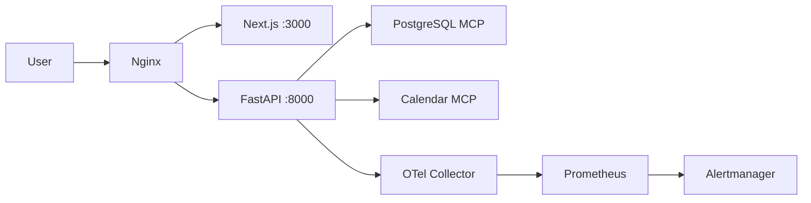

# Production Deployment Guide

**Version:** 1.0.0 | **Last Updated:** May 2026

---

## Architecture



---

## Prerequisites

- Docker 27+ and Docker Compose (local/staging)
- GitHub Container Registry access for signed images
- PostgreSQL database and MCP sidecars
- OpenRouter API key **or** local LLM endpoint
- TLS termination at ingress (nginx / load balancer)

---

## First-Time Deployment

1. Copy `.env.production.example` to `.env` and fill secrets.
2. Build or pull the signed image:

```bash
docker pull ghcr.io/qasirdev/daily-briefing:epic-autonomus-implementation
cosign verify \
  --certificate-identity-regexp='.*' \
  --certificate-oidc-issuer='https://token.actions.githubusercontent.com' \
  ghcr.io/qasirdev/daily-briefing@sha256:<digest>
```

3. Start the stack:

```bash
docker compose -f docker-compose.yml up -d
```

4. Verify probes:

```bash
curl -f http://localhost/health
curl -f http://localhost/health/ready
```

---

## Updates (Rolling)

1. Pull the new signed digest.
2. Run database migrations if any (`backend/migrations/`).
3. Replace the container with zero-downtime strategy at your orchestrator (Kubernetes rolling update, Container Apps revision, etc.).
4. Confirm `/health/ready` returns `healthy` before shifting traffic.

---

## Rollback

1. Redeploy the previous signed image digest.
2. Restore database snapshot if schema migrations were applied.
3. Verify SLO dashboards return to baseline within 15 minutes.

---

## Monitoring Setup

**Local development:** Follow [docs/guidence/observability/README.md](../guidence/observability/README.md) for Prometheus, Grafana, and PagerDuty setup via Docker Compose.

**Production:**

1. Load Prometheus recording rules from `infrastructure/monitoring/recording_rules.yml`.
2. Load alert rules from `infrastructure/alerting/rules.yml`.
3. Import `infrastructure/monitoring/grafana-slo-dashboard.json`.
4. Route alerts per `infrastructure/AGENT.md` (PagerDuty Events API v2 via Alertmanager).

---

## Scaling Guidance

- Scale FastAPI workers via supervisord/uvicorn replicas behind nginx.
- Keep MCP services colocated or reachable over private network only.
- Increase rate limits only after load testing and SLO review.

---

## Troubleshooting

| Symptom | Check |
|---|---|
| `/health/ready` 503 | MCP host/port env vars, database TCP reachability |
| 429 responses | Rate limits — inspect `rate_limit_exceeded` security logs |
| High DLQ volume | Prometheus `dlq_events_total`, agent escalation reasons |
| Missing traces | `OTEL_EXPORTER_OTLP_ENDPOINT` and collector health |

---

*Deployment Guide — Version 1.0.0 — May 2026*
